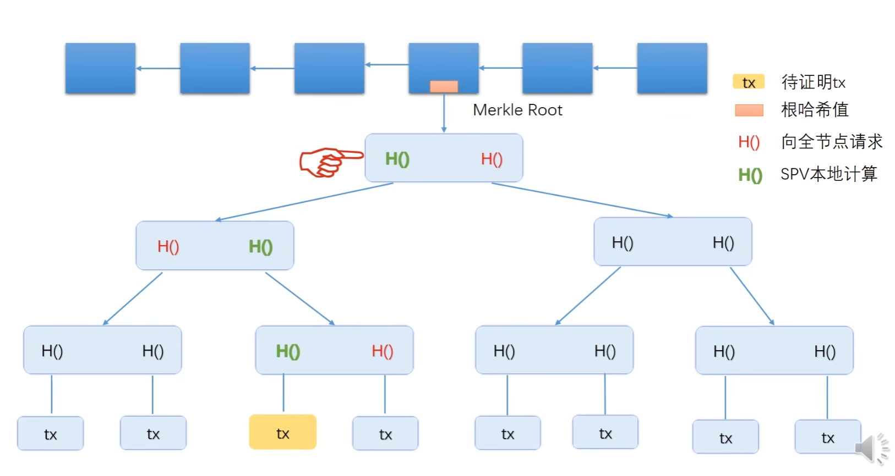
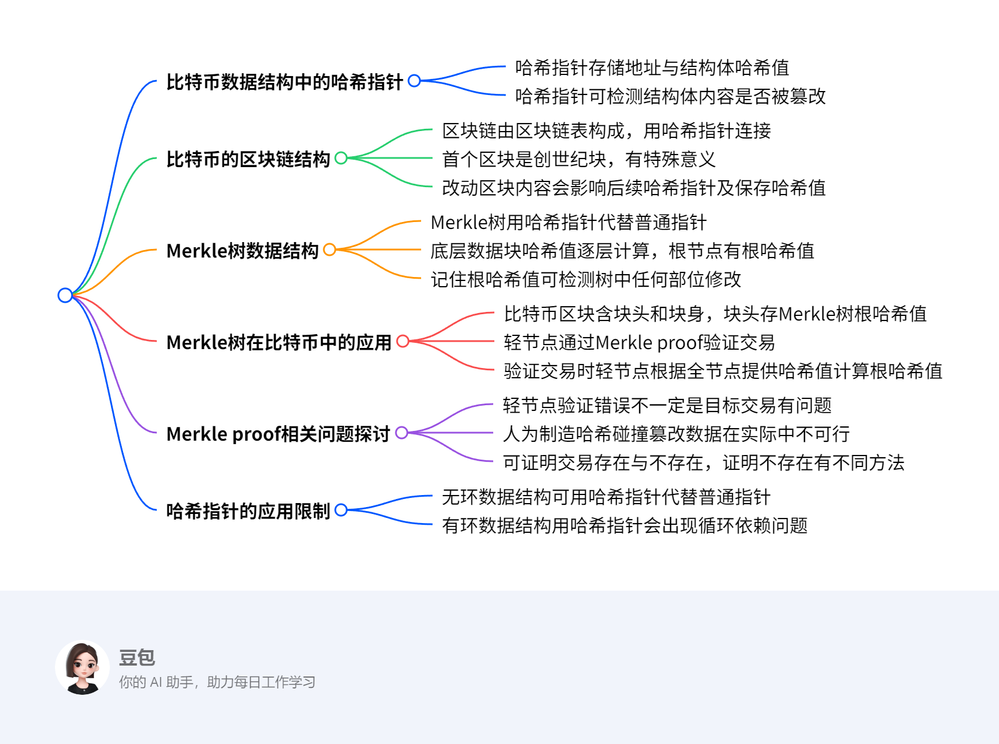

# 比特币数据结构

> **注意**: 本文档中的Go代码实现已移至 [gocode](./gocode/) 文件夹中，包括以下文件：
> - [transaction.go](./gocode/transaction.go) - 交易相关结构体和函数
> - [block.go](./gocode/block.go) - 区块相关结构体和函数
> - [utxo.go](./gocode/utxo.go) - UTXO相关结构体和函数
> - [blockchain.go](./gocode/blockchain.go) - 区块链相关结构体和函数
> - [main.go](./gocode/main.go) - 主程序和演示代码

## 核心数据结构概述

比特币系统中的核心数据结构包括：

1. **交易(Transaction)**: 比特币的基本单位，包含输入和输出
2. **区块(Block)**: 包含多笔交易的数据块，通过哈希链接形成区块链
3. **UTXO(Unspent Transaction Output)**: 未花费的交易输出，表示比特币的所有权
4. **区块链(Blockchain)**: 由区块按时间顺序链接而成的分布式账本

## 代码结构

[gocode](./gocode/) 文件夹中的Go代码实现了比特币的核心数据结构和功能，模块化设计如下：

### transaction.go
- `Transaction`: 交易结构体
- `TxInput`: 交易输入
- `TxOutput`: 交易输出
- `TransactionP2SH`: P2SH交易结构体
- `TxInputP2SH`: P2SH交易输入
- `TxOutputP2SH`: P2SH交易输出
- 交易哈希计算和验证方法

### block.go
- `Block`: 区块结构体
- `BlockHeader`: 区块头
- `BlockBody`: 区块体
- Merkle树构建和计算
- 区块哈希计算
- 工作量证明(PoW)挖矿

### utxo.go
- `UTXO`: 未花费交易输出
- `UTXOSet`: UTXO集合
- UTXO管理方法(添加、花费、查找)

### blockchain.go
- `Blockchain`: 区块链结构
- 区块添加方法
- UTXO集合更新
- 铸币交易创建
- 创世区块创建

### main.go
- 主程序和演示代码
- 区块链操作示例
- UTXO集合展示
- 区块链完整性验证

## P2SH (Pay to Script Hash) 详解

### P2PKH vs P2SH 对比

#### P2PKH (Pay to Public Key Hash) - 当前实现
**验证流程:**
1. TxOutput 包含: `PubKeyHash` (例如: Alice公钥的哈希)
2. 花费时Alice提供: `Signature + PubKey`
3. 验证步骤:
   - `hash(PubKey) == PubKeyHash` ✓ (证明这个输出属于Alice)
   - `verify(Signature, PubKey)` ✓ (证明Alice授权了这次花费)

#### P2SH (Pay to Script Hash) - 脚本模式
**验证流程:**
1. TxOutput 包含: `ScriptHash` (例如: 多签脚本的哈希)
2. 花费时提供: `ScriptSig + RedeemScript`  
3. 验证步骤:
   - `hash(RedeemScript) == ScriptHash` ✓ (证明这是正确的脚本)
   - 执行 `RedeemScript` 并传入 `ScriptSig` 数据 ✓ (证明能满足脚本条件)

### P2SH 实际应用示例

#### 示例1: 2-of-3 多重签名钱包

**创建P2SH输出:**
```go
// 实际的花费条件 (2-of-3多重签名)
redeemScript := "OP_2 <pubkey1> <pubkey2> <pubkey3> OP_3 OP_CHECKMULTISIG"
scriptHash := hash(redeemScript)

// P2SH输出
output := TxOutputP2SH{
    Value: 100,
    ScriptHash: scriptHash  // 多签脚本的哈希
}
```

**花费P2SH输出:**
```go
// 需要2个签名 + 原始脚本
input := TxInputP2SH{
    TxID: "previous_tx_id",
    OutIndex: 0,
    ScriptSig: "<signature1> <signature2>",  // 满足脚本的数据
    RedeemScript: "OP_2 <pubkey1> <pubkey2> <pubkey3> OP_3 OP_CHECKMULTISIG"  // 原始脚本
}
```

#### 示例2: 时间锁定交易

**创建时间锁定P2SH:**
```go
// 脚本条件: Alice可以在1周后花费，或者Bob可以立即花费
redeemScript := "IF <timestamp> CHECKLOCKTIMEVERIFY DROP <alice_pubkey> CHECKSIG ELSE <bob_pubkey> CHECKSIG ENDIF"
scriptHash := hash(redeemScript)

output := TxOutputP2SH{
    Value: 50,
    ScriptHash: scriptHash
}
```

### 为什么输入结构要改变?

**关键理解:** P2SH将验证从 "证明我拥有某个私钥" 改为 "证明我能满足某个脚本条件"

- **RedeemScript**: "花费条件" (需要证明什么)
- **ScriptSig**: "证据" (满足条件的数据)

这样设计的优势:
1. **隐私性**: 输出只显示脚本哈希，不暴露具体条件
2. **灵活性**: 支持复杂的花费条件
3. **向后兼容**: 可以实现各种支付场景

### P2SH的常见用例

1. **多重签名钱包**: 需要M个签名中的N个
2. **原子交换**: 跨链交易的哈希时间锁定合约
3. **托管服务**: 第三方仲裁的支付条件
4. **时间锁定**: 基于时间的支付条件
5. **复杂业务逻辑**: 自定义的支付规则





## 图中的文字
- 比特币数据结构中的哈希指针
	- 哈希指针存储地址与结构体哈希值
	- 哈希指针可检测结构体内容是否被篡改
- 比特币的区块链结构
	- 区块链由区块链表构成，用哈希指针连接
	- 首个区块是创世纪块，有特殊意义
	- 改动区块内容会影响后续哈希指针及保存哈希值
- Merkle树数据结构
	- Merkle树用哈希指针代替普通指针
	- 底层数据块哈希值逐层计算，根节点有根哈希值
	- 记住根哈希值可检测树中任何部位修改
- Merkle树在比特币中的应用
	- 比特币区块含块头和块身，块头存Merkle树根哈希值
	- 轻节点通过Merkle proof验证交易
	- 验证交易时轻节点根据全节点提供哈希值计算根哈希值
- Merkle proof相关问题探讨
	- 轻节点验证错误不一定是目标交易有问题
	- 人为制造哈希碰撞篡改数据在实际中不可行
	- 可证明交易存在与不存在，证明不存在有不同方法，可以使用sorted Merkle Tree，**但是比特币中没有需要证明不存的场景，所以不需要**
- 哈希指针的应用限制
	- 无环数据结构可用哈希指针代替普通指针
	- **有环数据结构用哈希指针会出现循环依赖问题**
