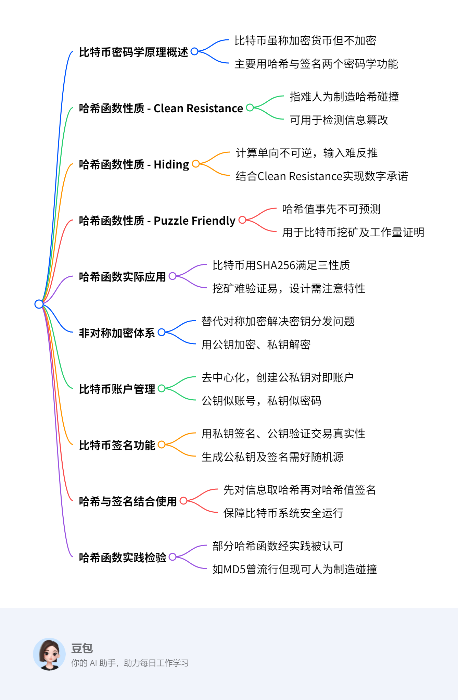

	比特币密码学原理概述
		比特币虽称加密货币但不加密
		主要用哈希与签名两个密码学功能
	哈希函数性质 - Clean Resistance
		指难人为制造哈希碰撞
		可用于检测信息篡改
	哈希函数性质 - Hiding
		计算单向不可逆，输入难反推
		结合Clean Resistance实现数字承诺
	哈希函数性质 - Puzzle Friendly
		哈希值事先不可预测
		用于比特币挖矿及工作量证明
	哈希函数实际应用
		比特币用SHA256满足三性质
		挖矿难验证易，设计需注意特性
	非对称加密体系
		替代对称加密解决密钥分发问题
		用公钥加密、私钥解密
	比特币账户管理
		去中心化，创建公私钥对即账户
		公钥似账号，私钥似密码
	比特币签名功能
		用私钥签名、公钥验证交易真实性
		生成公私钥及签名需好随机源
	哈希与签名结合使用
		先对信息取哈希再对哈希值签名
		保障比特币系统安全运行
	哈希函数实践检验
		部分哈希函数经实践被认可
		如MD5曾流行但现可人为制造碰撞
