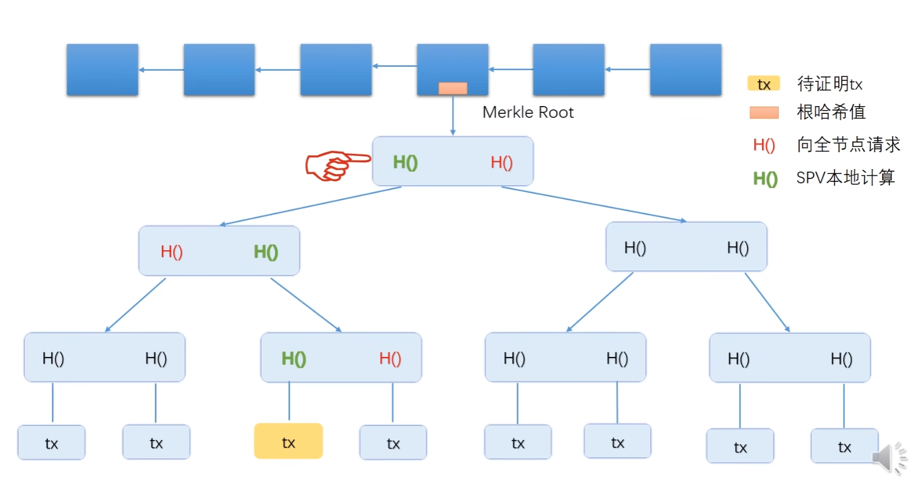
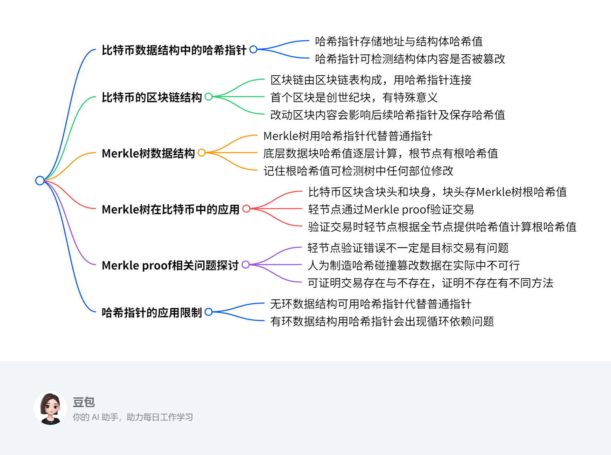

```go
package main

import (
	"crypto/sha256"
	"encoding/hex"
	"fmt"
	"time"
)

// BlockHeader 定义区块头结构
type BlockHeader struct {
	Index        int       // 区块高度
	Timestamp    time.Time // 时间戳
	PreviousHash string    // 前一个区块的哈希
	Hash         string    // 当前区块的哈希
	Nonce        int       // 随机数(用于PoW)
	MerkleRoot   string    // Merkle Tree 根哈希
}

// BlockBody 定义区块体结构
type BlockBody struct {
	Data string // 交易数据
}

// Block 组合区块头和区块体
type Block struct {
	Header BlockHeader
	Body   BlockBody
}

// NewBlock 创建新区块
func NewBlock(index int, data string, previousHash string) *Block {
	block := &Block{
		Header: BlockHeader{
			Index:        index,
			Timestamp:    time.Now(),
			PreviousHash: previousHash,
			Nonce:        0,
		},
		Body: BlockBody{
			Data: data,
		},
	}
	block.Header.Hash = block.calculateHash()
	return block
}

// calculateHash 计算区块哈希(SHA256)
func (b *Block) calculateHash() string {
	record := fmt.Sprintf("%d%s%s%s%s%d",
		b.Header.Index,
		b.Header.Timestamp.String(),
		b.Body.Data,
		b.Header.PreviousHash,
		b.Header.MerkleRoot,
		b.Header.Nonce)
	h := sha256.New()
	h.Write([]byte(record))
	hashed := h.Sum(nil)
	return hex.EncodeToString(hashed)
}

// MineBlock 工作量证明(PoW)
func (b *Block) MineBlock(difficulty int) {
	target := string(make([]byte, difficulty))
	for !isHashValid(b.Hash, difficulty) {
		b.Nonce++
		b.Hash = b.calculateHash()
	}
	fmt.Printf("区块挖矿成功: %s\n", b.Hash)
}

// isHashValid 验证哈希是否满足难度要求
func isHashValid(hash string, difficulty int) bool {
	target := string(make([]byte, difficulty))
	return hash[:difficulty] == target
}

// Blockchain 区块链结构
type Blockchain struct {
	Blocks []*Block
}

// AddBlock 添加区块到链
func (bc *Blockchain) AddBlock(data string) {
	prevBlock := bc.Blocks[len(bc.Blocks)-1]
	newBlock := NewBlock(prevBlock.Index+1, data, prevBlock.Hash)
	newBlock.MineBlock(2) // 难度设置为2
	bc.Blocks = append(bc.Blocks, newBlock)
}

// 创建创世区块
func CreateGenesisBlock() *Block {
	return NewBlock(0, "Genesis Block", "")
}

func main() {
	// 初始化区块链
	bc := Blockchain{}
	bc.Blocks = append(bc.Blocks, CreateGenesisBlock())

	// 添加新区块
	bc.AddBlock("第一笔交易")
	bc.AddBlock("第二笔交易")

	// 打印区块链
	for _, block := range bc.Blocks {
		fmt.Printf("Index: %d\n", block.Index)
		fmt.Printf("PrevHash: %s\n", block.PreviousHash)
		fmt.Printf("Hash: %s\n", block.Hash)
		fmt.Printf("Data: %s\n", block.Data)
		fmt.Println("-------------------")
	}
}

```






	比特币数据结构中的哈希指针
		哈希指针存储地址与结构体哈希值
		哈希指针可检测结构体内容是否被篡改
	比特币的区块链结构
		区块链由区块链表构成，用哈希指针连接
		首个区块是创世纪块，有特殊意义
		改动区块内容会影响后续哈希指针及保存哈希值
	Merkle树数据结构
		Merkle树用哈希指针代替普通指针
		底层数据块哈希值逐层计算，根节点有根哈希值
		记住根哈希值可检测树中任何部位修改
	Merkle树在比特币中的应用
		比特币区块含块头和块身，块头存Merkle树根哈希值
		轻节点通过Merkle proof验证交易
		验证交易时轻节点根据全节点提供哈希值计算根哈希值
	Merkle proof相关问题探讨
		轻节点验证错误不一定是目标交易有问题
		人为制造哈希碰撞篡改数据在实际中不可行
		可证明交易存在与不存在，证明不存在有不同方法
	哈希指针的应用限制
		无环数据结构可用哈希指针代替普通指针
		有环数据结构用哈希指针会出现循环依赖问题