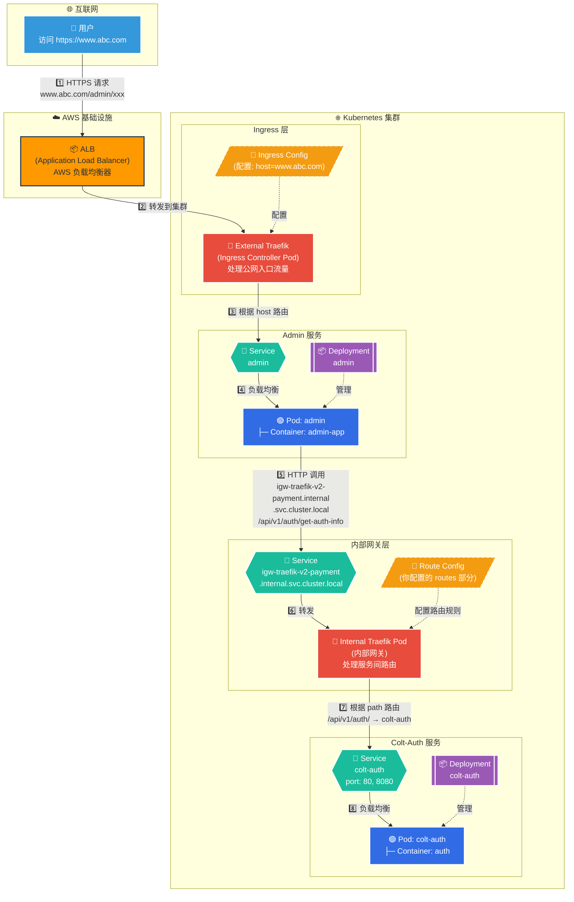

# Kubernetes 流量路由可视化
_Exported on 12/5/2025 at 22:46:46 GMT+8 from Cursor (2.1.48)_

---


**Cursor**

我来帮你画一个清晰的架构图，解释流量是如何一步步到达 Pod 的。



## 📖 图例说明

| 形状/颜色 | 含义 | 说明 |
|---------|------|------|
| 🟠 橙色方框 | AWS 资源 | ALB 等云厂商提供的基础设施 |
| 🔵 蓝色方框 | Pod | 实际运行容器的最小单元 |
| 🟢 绿色菱形 | Service | K8s 服务发现和负载均衡抽象 |
| 🟣 紫色双线框 | Deployment | K8s 部署配置，管理 Pod 副本 |
| 🟡 虚线框 | 配置 | Ingress/Route 配置文件 |
| 🔴 红色方框 | Traefik | 流量网关/路由器 Pod |

---

## 🔄 流量路径详解

### 路径 A：外部用户 → Admin Pod（步骤 1-4）

```
用户浏览器 → ALB → External Traefik → Admin Service → Admin Pod
```

1. **用户发起请求**：浏览器访问 `https://www.abc.com/admin/xxx`
2. **ALB 接收**：AWS 的应用负载均衡器接收 HTTPS 流量，SSL 卸载
3. **Ingress Controller 路由**：External Traefik 根据 `Ingress` 配置的 `host: www.abc.com` 找到对应后端
4. **Service 负载均衡**：`admin` Service 将请求分发到健康的 Admin Pod

### 路径 B：Admin Pod → Colt-Auth Pod（步骤 5-8）

```
Admin Pod → IGW Service → Internal Traefik → Auth Service → Auth Pod
```

5. **Admin 发起内部调用**：Admin 容器代码调用 `http://igw-traefik-v2-payment.internal.svc.cluster.local/api/v1/auth/get-auth-info`
6. **K8s DNS 解析**：集群内 DNS 将域名解析到 IGW Service 的 ClusterIP
7. **内部网关路由**：Internal Traefik 根据你配置的 `routes` 中的 `paths: /api/v1/auth/` 规则，将请求转发到 `colt-auth` Service
8. **Service 负载均衡**：`colt-auth` Service（端口 80）将请求分发到 Auth Pod

---

## 🧩 关键概念对照表

| 你配置的内容 | 对应的 K8s 概念 | 作用 |
|------------|---------------|------|
| `deployments.name: colt-auth` | Deployment | 声明要部署的应用，管理 Pod 副本数、更新策略等 |
| `containers` | Container (in Pod) | Pod 内运行的实际容器 |
| `service.name: colt-auth` | Service | 为 Pod 提供稳定的网络访问入口 |
| `service.ports` | Service Ports | Service 暴露的端口映射 |
| `routes` | IngressRoute/自定义 CRD | Traefik 的路由规则配置 |
| `routes.hosts` | 路由目标网关 | 指定哪个 Traefik 网关处理这个路由 |
| `routes.paths` | Path 匹配规则 | 根据 URL 路径前缀进行路由 |

---

## 💡 为什么需要内部网关（IGW）？

你可能会问：为什么 Admin 不直接调用 `colt-auth.namespace.svc.cluster.local`？

使用内部网关的好处：
1. **统一入口**：所有服务间调用都走网关，便于统一管理
2. **路由灵活**：可以根据 path 路由到不同服务，不需要知道具体服务名
3. **可观测性**：网关层可以统一做日志、监控、限流
4. **版本切换**：可以在网关层做灰度发布、流量切换


```plaintext
用户浏览器 → ALB → External Traefik → Admin Service → Admin Pod
```

```plaintext
Admin Pod → IGW Service → Internal Traefik → Auth Service → Auth Pod
```

