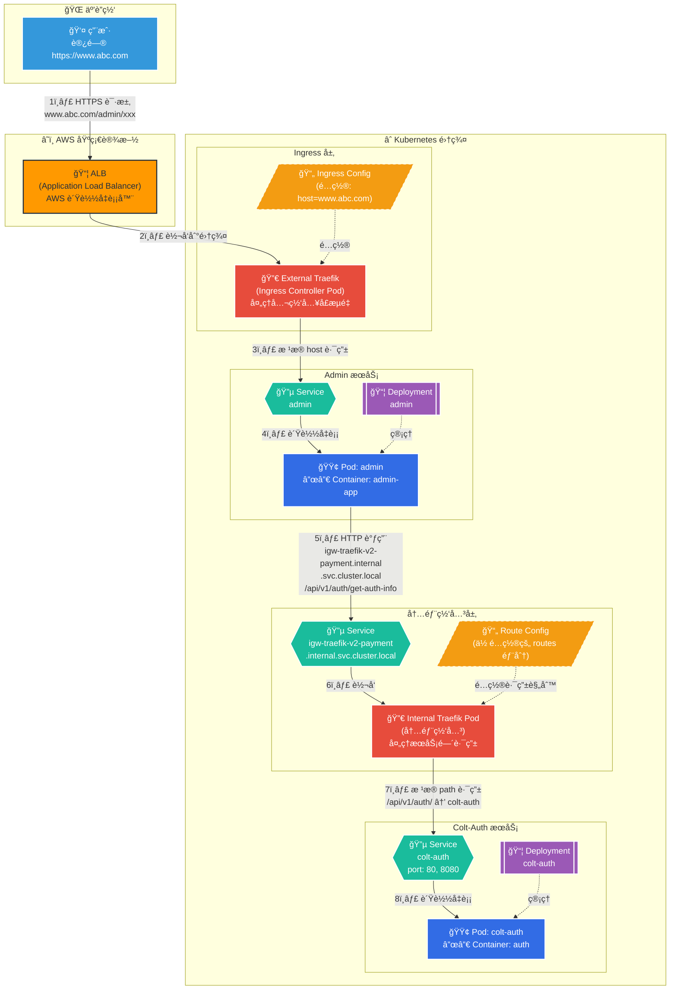

# Kubernetes æµé‡è·¯ç”±å¯è§†åŒ–
_Exported on 12/5/2025 at 22:46:46 GMT+8 from Cursor (2.1.48)_

---


**Cursor**

我æ¥å¸®ä½ ç”»ä¸€ä¸ªæ¸…æ™°çš„æ¶æ„图，解释æµé‡æ˜¯å¦‚何一步步到达 Pod 的。



## 📖 图例说æ˜

| 形状/颜色 | å«ä¹‰ | è¯´æ˜ |
|---------|------|------|
| 🟠 橙色方框 | AWS èµ„æº | ALB 等云å‚商æ供的基础设施 |
| 🔵 è“色方框 | Pod | å®é™…è¿è¡Œå®¹å™¨çš„最å°å•å…ƒ |
| 🟢 绿色è±å½¢ | Service | K8s æœåŠ¡å‘ç°å’Œè´Ÿè½½å‡è¡¡æŠ½è±¡ |
| 🟣 紫色åŒçº¿æ¡† | Deployment | K8s 部署é…ç½®ï¼Œç®¡ç† Pod 副本 |
| 🟡 虚线框 | é…ç½® | Ingress/Route é…置文件 |
| 🔴 红色方框 | Traefik | æµé‡ç½‘å…³/路由器 Pod |

---

## 🔄 æµé‡è·¯å¾„详解

### 路径 A：外部用户 → Admin Pod（步骤 1-4）

```
用户æµè§ˆå™¨ → ALB → External Traefik → Admin Service → Admin Pod
```

1. **用户å‘起请求**：æµè§ˆå™¨è®¿é—® `https://www.abc.com/admin/xxx`
2. **ALB æ¥æ”¶**：AWS 的应用负载å‡è¡¡å™¨æ¥æ”¶ HTTPS æµé‡ï¼ŒSSL å¸è½½
3. **Ingress Controller 路由**：External Traefik æ ¹æ® `Ingress` é…置的 `host: www.abc.com` 找到对应å端
4. **Service è´Ÿè½½å‡è¡¡**：`admin` Service 将请求分å‘到å¥åº·çš„ Admin Pod

### 路径 B：Admin Pod → Colt-Auth Pod（步骤 5-8）

```
Admin Pod → IGW Service → Internal Traefik → Auth Service → Auth Pod
```

5. **Admin å‘起内部调用**：Admin 容器代ç è°ƒç”¨ `http://igw-traefik-v2-payment.internal.svc.cluster.local/api/v1/auth/get-auth-info`
6. **K8s DNS 解æ**：集群内 DNS 将域å解æ到 IGW Service çš„ ClusterIP
7. **内部网关路由**：Internal Traefik æ ¹æ®ä½ é…置的 `routes` 中的 `paths: /api/v1/auth/` 规则，将请求转å‘到 `colt-auth` Service
8. **Service è´Ÿè½½å‡è¡¡**：`colt-auth` Serviceï¼ˆç«¯å£ 80）将请求分å‘到 Auth Pod

---

## 🧩 关键概念对照表

| ä½ é…置的内容 | 对应的 K8s 概念 | 作用 |
|------------|---------------|------|
| `deployments.name: colt-auth` | Deployment | 声æ˜è¦éƒ¨ç½²çš„åº”ç”¨ï¼Œç®¡ç† Pod 副本数ã€æ›´æ–°ç­–略等 |
| `containers` | Container (in Pod) | Pod 内è¿è¡Œçš„å®é™…容器 |
| `service.name: colt-auth` | Service | 为 Pod æä¾›ç¨³å®šçš„ç½‘ç»œè®¿é—®å…¥å£ |
| `service.ports` | Service Ports | Service 暴露的端å£æ˜ å°„ |
| `routes` | IngressRoute/自定义 CRD | Traefik 的路由规则é…ç½® |
| `routes.hosts` | 路由目标网关 | 指定哪个 Traefik 网关处ç†è¿™ä¸ªè·¯ç”± |
| `routes.paths` | Path 匹é…规则 | æ ¹æ® URL 路径å‰ç¼€è¿›è¡Œè·¯ç”± |

---

## 💡 为什么需è¦å†…部网关（IGW）？

ä½ å¯èƒ½ä¼šé—®ï¼šä¸ºä»€ä¹ˆ Admin ä¸ç›´æ¥è°ƒç”¨ `colt-auth.namespace.svc.cluster.local`？

使用内部网关的好处：
1. **统一入å£**：所有æœåŠ¡é—´è°ƒç”¨éƒ½èµ°ç½‘关，便äºç»Ÿä¸€ç®¡ç†
2. **路由çµæ´»**：å¯ä»¥æ ¹æ® path 路由到ä¸åŒæœåŠ¡ï¼Œä¸éœ€è¦çŸ¥é“具体æœåŠ¡å
3. **å¯è§‚测性**：网关层å¯ä»¥ç»Ÿä¸€åšæ—¥å¿—ã€ç›‘æ§ã€é™æµ
4. **版本切æ¢**：å¯ä»¥åœ¨ç½‘关层åšç°åº¦å‘布ã€æµé‡åˆ‡æ¢


```plaintext
用户æµè§ˆå™¨ → ALB → External Traefik → Admin Service → Admin Pod
```

```plaintext
Admin Pod → IGW Service → Internal Traefik → Auth Service → Auth Pod
```

