# DDD核心概念详解

本文档详细解释领域驱动设计(DDD)的核心概念，并通过本项目的具体实现帮助开发者理解从贫血模式到DDD架构的转变。

## 📋 目录

- [什么是DDD](#什么是ddd)
- [DDD核心概念](#ddd核心概念)
- [分层架构](#分层架构)
- [从贫血模式到DDD](#从贫血模式到ddd)
- [领域建模实践](#领域建模实践)
- [代码组织原则](#代码组织原则)
- [最佳实践](#最佳实践)
- [常见误区](#常见误区)

## 🎯 什么是DDD

领域驱动设计(Domain-Driven Design, DDD)是一种软件开发方法，核心思想是：

> **通过深入理解业务领域，将业务知识融入软件设计，创建能够准确表达业务概念的软件模型。**

DDD的主要优势：
- **业务导向**: 代码直接反映业务概念和规则
- **高内聚低耦合**: 领域模型包含业务逻辑，减少重复代码
- **可维护性**: 业务逻辑集中，便于理解和修改
- **可测试性**: 领域逻辑可以独立测试

## 🧩 DDD核心概念

### 1. 实体 (Entity)

**定义**: 具有唯一标识的对象，即使属性相同，标识不同就是不同的对象。

**特点**:
- 有唯一的业务标识(ID)
- 生命周期可能很长
- 状态会随时间变化
- 通过标识进行相等性比较

**项目实现** (`domain/user.go`):
```go
type User struct {
    id        string
    name      string
    email     Email
    age       int
    isActive  bool
    createdAt time.Time
    updatedAt time.Time
}

// 业务行为方法
func (u *User) CanMakePurchase() bool {
    return u.isActive && u.age >= 18
}

func (u *User) Activate() {
    u.isActive = true
    u.updatedAt = time.Now()
}

func (u *User) Deactivate() {
    u.isActive = false
    u.updatedAt = time.Now()
}

// 提供访问方法而非直接暴露字段
func (u *User) ID() string {
    return u.id
}

func (u *User) Name() string {
    return u.name
}

func (u *User) Email() Email {
    return u.email
}

func (u *User) Age() int {
    return u.age
}

func (u *User) IsActive() bool {
    return u.isActive
}

func (u *User) CreatedAt() time.Time {
    return u.createdAt
}

func (u *User) UpdatedAt() time.Time {
    return u.updatedAt
}
```

### 2. 值对象 (Value Object)

**定义**: 描述领域中的某个概念，通过值而非标识来区分。

**特点**:
- 没有唯一标识
- 不可变(immutable)
- 通过值相等性比较
- 可以组合其他值对象

**项目实现** (`domain/value_objects.go`):
```go
type Email struct {
    value string
}

// 创建时验证格式
func NewEmail(value string) (*Email, error) {
    if !isValidEmail(value) {
        return nil, ErrInvalidEmail
    }
    return &Email{value: value}, nil
}

// Value 获取邮箱值
func (e Email) Value() string {
    return e.value
}

// Equals 比较两个Email值对象是否相等
func (e Email) Equals(other Email) bool {
    return e.value == other.value
}

// String 实现Stringer接口
func (e Email) String() string {
    return e.value
}


type Money struct {
    amount   int64  // 以分为单位，避免浮点数精度问题
    currency string
}

func NewMoney(amount int64, currency string) *Money {
    return &Money{
        amount:   amount,
        currency: currency,
    }
}

// Amount 获取金额数量
func (m Money) Amount() int64 {
    return m.amount
}

// Currency 获取货币类型
func (m Money) Currency() string {
    return m.currency
}

// Add 金额相加，返回新的Money值对象
func (m Money) Add(other Money) (*Money, error) {
    if m.currency != other.currency {
        return nil, errors.New("cannot add money with different currencies")
    }

    return &Money{
        amount:   m.amount + other.amount,
        currency: m.currency,
    }, nil
}
```

### 3. 领域服务 (Domain Service)

**定义**: 处理不属于任何单个实体的业务逻辑，通常涉及多个实体或值对象。

**特点**:
- 无状态(stateless)
- 协调多个实体完成业务操作
- 包含复杂的业务规则

**项目实现** (`domain/services.go`):
```go
type UserDomainService struct {
    userRepository  UserRepository
    orderRepository OrderRepository
}

// 检查用户是否可以创建订单
// DDD原则：领域服务可依赖 Repository 接口查询数据，但不调用 Save 持久化
func (s *UserDomainService) CanUserPlaceOrder(ctx context.Context, userID string) (bool, error) {
    user, err := s.userRepository.FindByID(ctx, userID)
    if err != nil {
        return false, err
    }

    // 检查用户是否激活
    if !user.IsActive() {
        return false, ErrUserNotActive
    }

    // 检查用户是否可以购买（年龄等业务规则封装在实体内）
    if !user.CanMakePurchase() {
        return false, errors.New("user cannot make purchases")
    }

    return true, nil
}

// 计算用户总消费金额
func (s *UserDomainService) CalculateUserTotalSpent(ctx context.Context, userID string) (Money, error) {
    orders, err := s.orderRepository.FindDeliveredOrdersByUserID(ctx, userID)
    if err != nil {
        return Money{}, err
    }

    total := NewMoney(0, "CNY")
    for _, order := range orders {
        total, _ = total.Add(order.TotalAmount())
    }

    return *total, nil
}
```

### 4. 领域事件 (Domain Event)

**定义**: 表示领域中发生的重要事件，用于解耦不同模块。

**特点**:
- 表示过去发生的事情
- 包含事件相关的数据
- 用于触发其他业务逻辑

**项目实现** (`domain/events.go`):
```go
type UserCreatedEvent struct {
    userID     string
    name       string
    email      string
    occurredOn time.Time
}

func NewUserCreatedEvent(userID, name, email string) UserCreatedEvent {
    return UserCreatedEvent{
        userID:     userID,
        name:       name,
        email:      email,
        occurredOn: time.Now(),
    }
}

func (e UserCreatedEvent) GetUserID() string {
    return e.userID
}

func (e UserCreatedEvent) GetOccurredOn() time.Time {
    return e.occurredOn
}

type OrderCreatedEvent struct {
    orderID    string
    userID     string
    totalAmount Money
    occurredOn time.Time
}

func NewOrderCreatedEvent(orderID, userID string, totalAmount Money) OrderCreatedEvent {
    return OrderCreatedEvent{
        orderID:     orderID,
        userID:      userID,
        totalAmount: totalAmount,
        occurredOn:  time.Now(),
    }
}
```

### 5. 仓储 (Repository)

**定义**: 提供领域对象的持久化机制，屏蔽底层数据存储细节。

**特点**:
- 提供领域语义的数据访问接口
- 不暴露底层数据存储细节
- 支持聚合根的生命周期管理

**项目实现** (`domain/repositories.go`):
```go
// DDD原则：
// 1. 仓储只负责聚合根的持久化，不发布事件
// 2. 不应该暴露批量查询（如FindAll），这类操作应该放在查询服务中
// 3. 使用NextIdentity生成ID
// 4. 事件由 UoW 保存到 outbox 表，后台 Message Relay 异步发布

type UserRepository interface {
    NextIdentity() string                             // 生成新的用户ID
    Save(ctx context.Context, user *User) error       // 只负责持久化
    FindByID(ctx context.Context, id string) (*User, error)
    FindByEmail(ctx context.Context, email string) (*User, error)
    Remove(ctx context.Context, id string) error      // 逻辑删除
}

type OrderRepository interface {
    NextIdentity() string
    Save(ctx context.Context, order *Order) error     // 只负责持久化
    FindByID(ctx context.Context, id string) (*Order, error)
    FindByUserID(ctx context.Context, userID string) ([]*Order, error)
    FindDeliveredOrdersByUserID(ctx context.Context, userID string) ([]*Order, error)
    Remove(ctx context.Context, id string) error      // 逻辑删除（标记为已取消）
}
```

### 6. 工厂 (Factory)

**定义**: 负责创建复杂的领域对象，封装创建逻辑。

**项目实现** (在实体中实现):
```go
// User工厂方法
func NewUser(name string, email string, age int) (*User, error) {
    if name == "" {
        return nil, ErrInvalidName
    }

    emailVO, err := NewEmail(email)
    if err != nil {
        return nil, err
    }

    if age < 0 || age > 150 {
        return nil, ErrInvalidAge
    }

    now := time.Now()
    return &User{
        id:        uuid.New().String(),
        name:      name,
        email:     *emailVO,
        age:       age,
        isActive:  true,
        createdAt: now,
        updatedAt: now,
    }, nil
}
```

## 🏗️ 分层架构

DDD采用分层架构，每层有明确的职责：

**架构层级关系图**：

```
┌─────────────────────────────────────────────────────────────┐
│           用户界面层 (User Interface Layer)                  │
│  ┌───────────────────────────────────────────────────────┐  │
│  │  API层 (api/)                                         │  │
│  │  - UserController  ◄─ 处理HTTP请求                    │  │
│  │  - OrderController  ◄─ 路由和响应                     │  │
│  │  - Middleware       ◄─ 认证、日志、CORS               │  │
│  └───────────────────┬───────────────────────────────────┘  │
└─────────────────────┼──────────────────────────────────────────┘
                      │ 依赖 (通过DTO)
                      ↓
┌─────────────────────────────────────────────────────────────┐
│           应用层 (Application Layer)                         │
│  ┌───────────────────────────────────────────────────────┐  │
│  │  Service层 (service/)                                  │  │
│  │  - UserApplicationService  ◄─ 编排业务流程            │  │
│  │  - OrderApplicationService ◄─ 事务管理和权限验证      │  │
│  │  - DTO (Request/Response)  ◄─ 数据传输对象            │  │
│  └───────────────────┬───────────────────────────────────┘  │
└─────────────────────┼──────────────────────────────────────────┘
                      │ 依赖 (通过接口)
                      ↓
┌─────────────────────────────────────────────────────────────┐
│           领域层 (Domain Layer)  ◄─ 核心层                   │
│  ┌───────────────────────────────────────────────────────┐  │
│  │  Domain层 (domain/)                                    │  │
│  │  ┌──────────────────────────────────────────────┐     │  │
│  │  │  实体 (Entity)                               │     │  │
│  │  │  - User (聚合根)  ◄─ 业务主体                │     │  │
│  │  │  - Order (聚合根) ◄─ 包含OrderItem           │     │  │
│  │  └──────────────────┬───────────────────────────┘     │  │
│  │                     │  组合                          │  │
│  │  ┌──────────────────▼───────────────────────────┐     │  │
│  │  │  值对象 (Value Object)                       │     │  │
│  │  │  - Email  ◄─ 不可变、验证格式                │     │  │
│  │  │  - Money  ◄─ 不可变、封装货币逻辑            │     │  │
│  │  │  - OrderItem  ◄─ 描述订单项                  │     │  │
│  │  └──────────────────┬───────────────────────────┘     │  │
│  │                     │  使用                          │  │
│  │  ┌──────────────────▼───────────────────────────┐     │  │
│  │  │  领域服务 (Domain Service)                   │     │  │
│  │  │  - UserDomainService  ◄─ 跨实体业务逻辑     │     │  │
│  │  │  - OrderDomainService ◄─ 订单处理流程       │     │  │
│  │  └──────────────────┬───────────────────────────┘     │  │
│  │                     │  发布/订阅                     │  │
│  │  ┌──────────────────▼───────────────────────────┐     │  │
│  │  │  领域事件 (Domain Event)                     │     │  │
│  │  │  - UserCreatedEvent  ◄─ 用户已创建          │     │  │
│  │  │  - OrderPlacedEvent  ◄─ 订单已下单          │     │  │
│  │  └──────────────────┬───────────────────────────┘     │  │
│  │                     │  定义                          │  │
│  │  ┌──────────────────▼───────────────────────────┐     │  │
│  │  │  仓储接口 (Repository Interface)             │     │  │
│  │  │  - UserRepository    ◄─ 抽象持久化接口      │     │  │
│  │  │  - OrderRepository   ◄─ 屏蔽存储细节        │     │  │
│  │  └──────────────────────────────────────────────┘     │  │
│  └───────────────────┬───────────────────────────────────┘  │
└─────────────────────┼──────────────────────────────────────────┘
                      │ 依赖倒置 (通过接口) ─────────────────┐
                      ↓                                         │
┌─────────────────────────────────────────────────────────────┐ │
│       基础设施层 (Infrastructure Layer)                      │ │
│  ┌───────────────────────────────────────────────────────┐  │ │
│  │  Mock层 (mock/)  ◄─ 测试实现                           │  │ │
│  │  - MockUserRepository  ───────────────────────────────┼──┘ │
│  │  - MockOrderRepository ◄─ 实现仓储接口                │    │
│  │  - MockEventPublisher  ◄─ 实现事件发布器              │    │
│  └───────────────────────────────────────────────────────┘    │
│                                                               │
│  📦 可替换为真实实现：                                         │
│  - MySQL/PostgreSQL (数据库存储)                             │
│  - Redis/MongoDB (缓存/NoSQL)                                │
│  - Kafka/RabbitMQ (消息队列)                                 │
└───────────────────────────────────────────────────────────────┘

依赖原则：
- 上层依赖下层（接口）
- 下层不依赖上层
- 领域层是核心，不依赖任何其他层
- 依赖倒置：应用层依赖领域层的接口，而非具体实现
```

### 1. 用户界面层 (User Interface Layer)

**职责**: 处理用户请求和响应展示

**项目实现** (`api/` 目录):
- 控制器(Controller): 处理HTTP请求
- 路由(Router): 定义API端点
- 中间件(Middleware): 处理跨切面关注点

```go
// UserController - 处理用户相关的HTTP请求
type UserController struct {
    userService *service.UserApplicationService
}

func (c *UserController) CreateUser(ctx *gin.Context) {
    var req CreateUserRequest
    if err := ctx.ShouldBindJSON(&req); err != nil {
        api.HandleError(ctx, err)
        return
    }
    
    response, err := c.userService.CreateUser(req)
    if err != nil {
        api.HandleError(ctx, err)
        return
    }
    
    api.HandleSuccess(ctx, response)
}
```

### 2. 应用层 (Application Layer)

**职责**: 协调领域层完成业务流程，不包含业务规则

**项目实现** (`service/` 目录):
- 应用服务(Application Service): 编排业务流程
- DTO (Data Transfer Object): 数据传输对象

```go
type UserApplicationService struct {
    userRepo          domain.UserRepository      // ✓ 依赖仓储接口
    orderRepo         domain.OrderRepository     // ✓ 可依赖多个仓储
    userDomainService *domain.UserDomainService  // ✓ 依赖领域服务
    uow               domain.UnitOfWork          // ✓ 依赖工作单元（管理事务和事件）
}

func (s *UserApplicationService) CreateUser(req CreateUserRequest) (*CreateUserResponse, error) {
    // 验证邮箱唯一性
    existingUser, _ := s.userRepo.FindByEmail(req.Email)
    if existingUser != nil {
        return nil, ErrEmailAlreadyExists
    }

    // 创建用户实体（聚合根在创建时自动记录领域事件）
    user, err := domain.NewUser(req.Name, req.Email, req.Age)
    if err != nil {
        return nil, err
    }

    // 保存用户（仓储只负责持久化，不发布事件）
    if err := s.userRepo.Save(user); err != nil {
        return nil, err
    }

    // 注意：事件由 UoW 保存到 outbox 表，后台 Message Relay 异步发布

    return &CreateUserResponse{
        ID:        user.ID(),
        Name:      user.Name(),
        Email:     user.Email().Value(),
        Age:       user.Age(),
        IsActive:  user.IsActive(),
        CreatedAt: user.CreatedAt(),
        UpdatedAt: user.UpdatedAt(),
    }, nil
}
```

### 3. 领域层 (Domain Layer)

**职责**: 包含核心业务逻辑和规则

**项目实现** (`domain/` 目录):
- 实体(Entity): 业务对象
- 值对象(Value Object): 描述业务概念
- 领域服务(Domain Service): 复杂业务逻辑
- 领域事件(Domain Event): 重要业务事件

**领域模型关系图**：

```mermaid
classDiagram
    %% 实体（聚合根）
    class User {
        <<Entity>>
        -id: string
        -name: string
        -email: Email
        -age: int
        -isActive: bool
        -createdAt: time.Time
        -updatedAt: time.Time
        +NewUser(name, email, age) *User
        +ID() string
        +Name() string
        +Email() Email
        +Age() int
        +IsActive() bool
        +CreatedAt() time.Time
        +UpdatedAt() time.Time
        +Activate()
        +Deactivate()
        +UpdateName(name string) error
        +CanMakePurchase() bool
    }

    class Order {
        <<Entity>>
        -id: string
        -userID: string
        -items: []OrderItem
        -totalAmount: Money
        -status: OrderStatus
        -createdAt: time.Time
        -updatedAt: time.Time
        +NewOrder(userID string, items []OrderItem) *Order
        +ID() string
        +UserID() string
        +Items() []OrderItem
        +TotalAmount() Money
        +Status() OrderStatus
        +CreatedAt() time.Time
        +UpdatedAt() time.Time
        +Confirm() error
        +Cancel() error
        +Ship() error
        +Deliver() error
    }

    %% 值对象
    class Email {
        <<ValueObject>>
        -value: string
        +NewEmail(value string) *Email
        +Value() string
        +String() string
        +Equals(other Email) bool
    }

    class Money {
        <<ValueObject>>
        -amount: int64
        -currency: string
        +NewMoney(amount int64, currency string) *Money
        +Amount() int64
        +Currency() string
        +Add(other Money) (*Money, error)
        +Subtract(other Money) (*Money, error)
        +IsGreaterThan(other Money) bool
    }

    class OrderItem {
        <<ValueObject>>
        -productID: string
        -productName: string
        -quantity: int
        -unitPrice: Money
        -subtotal: Money
        +NewOrderItem(productID, productName string, quantity int, unitPrice Money) OrderItem
        +ProductID() string
        +ProductName() string
        +Quantity() int
        +UnitPrice() Money
        +Subtotal() Money
    }

    class OrderStatus {
        <<ValueObject/Enum>>
        PENDING
        CONFIRMED
        SHIPPED
        DELIVERED
        CANCELLED
    }

    %% 领域服务
    class UserDomainService {
        <<DomainService>>
        -userRepository: domain.UserRepository
        -orderRepository: domain.OrderRepository
        +NewUserDomainService(userRepo, orderRepo) *UserDomainService
        +CanUserPlaceOrder(userID string) (bool, error)
        +CalculateUserTotalSpent(userID string) (Money, error)
    }

    class OrderDomainService {
        <<DomainService>>
        -userRepository: domain.UserRepository
        -orderRepository: domain.OrderRepository
        +NewOrderDomainService(userRepo, orderRepo) *OrderDomainService
        +ProcessOrder(orderID string) error
    }

    %% 领域事件
    class UserCreatedEvent {
        <<DomainEvent>>
        -userID: string
        -name: string
        -email: string
        -occurredOn: time.Time
        +NewUserCreatedEvent(userID, name, email) *UserCreatedEvent
        +UserID() string
        +Name() string
        +Email() string
        +OccurredOn() time.Time
    }

    class OrderPlacedEvent {
        <<DomainEvent>>
        -orderID: string
        -userID: string
        -totalAmount: Money
        -occurredOn: time.Time
        +NewOrderPlacedEvent(orderID, userID string, totalAmount Money) *OrderPlacedEvent
        +OrderID() string
        +UserID() string
        +TotalAmount() Money
        +OccurredOn() time.Time
    }

    %% 仓储接口
    class UserRepository {
        <<Repository Interface>>
        <<interface>>
        +Save(user *User) error
        +FindByID(id string) (*User, error)
        +FindByEmail(email string) (*User, error)
        +FindAll() ([]*User, error)
        +Delete(id string) error
    }

    class OrderRepository {
        <<Repository Interface>>
        <<interface>>
        +Save(order *Order) error
        +FindByID(id string) (*Order, error)
        +FindByUserID(userID string) ([]*Order, error)
        +FindByUserIDAndStatus(userID string, status OrderStatus) ([]*Order, error)
        +FindAll() ([]*Order, error)
        +Delete(id string) error
    }

    %% 关系定义
    User "1" --> "1" Email : has
    Order "1" --> "*" OrderItem : contains
    OrderItem "1" --> "1" Money : hasUnitPrice
    OrderItem "1" --> "1" Money : hasSubtotal
    Order "1" --> "1" OrderStatus : hasStatus
    Order "1" --> "1" Money : hasTotalAmount

    UserDomainService ..> User : uses
    UserDomainService ..> Order : uses
    OrderDomainService ..> User : uses
    OrderDomainService ..> Order : uses

    UserCreatedEvent --> User : describes
    OrderPlacedEvent --> Order : describes

    UserRepository ..> User : manages
    OrderRepository ..> Order : manages

    %% 层级关系
    note for User "领域层核心\n包含所有业务逻辑"
    note for UserRepository "领域层接口\n屏蔽存储细节"
    note for UserCreatedEvent "领域事件\n解耦模块"
```




### 4. 基础设施层 (Infrastructure Layer)

**职责**: 提供技术实现支持

**项目实现** (`mock/` 目录):
- 仓储实现(Repository Implementation)
- 事件发布实现(Event Publisher)
- 外部服务集成

## 🔄 从贫血模式到DDD

### 贫血模式的问题

贫血模式(Anemic Domain Model)中，实体只包含数据，没有行为：

```go
// ❌ 贫血模式 - 不推荐
type User struct {
    ID       string `json:"id"`
    Name     string `json:"name"`
    Email    string `json:"email"`
    Age      int    `json:"age"`
    IsActive bool   `json:"is_active"`
}

// 所有业务逻辑都在服务层
type UserService struct {
    repo UserRepository
}

func (s *UserService) CreateUser(name, email string, age int) error {
    // 验证逻辑分散在服务层
    if name == "" {
        return errors.New("name cannot be empty")
    }
    if age < 0 || age > 150 {
        return errors.New("invalid age")
    }
    if !isValidEmail(email) {
        return errors.New("invalid email format")
    }
    
    user := &User{
        ID:       generateID(),
        Name:     name,
        Email:    email,
        Age:      age,
        IsActive: true,
    }
    
    return s.repo.Save(user)
}

func (s *UserService) CanUserMakePurchase(userID string) (bool, error) {
    user, err := s.repo.FindByID(userID)
    if err != nil {
        return false, err
    }
    
    // 业务逻辑分散在服务层
    if !user.IsActive {
        return false, nil
    }
    if user.Age < 18 {
        return false, nil
    }
    
    return true, nil
}
```

**贫血模式的问题**:
1. **低内聚**: 业务逻辑分散在各个服务中
2. **重复代码**: 相同的验证逻辑可能出现在多个地方
3. **难以维护**: 修改业务规则需要找到所有相关代码
4. **测试困难**: 需要测试整个服务层才能验证业务逻辑

### DDD的优势

DDD通过富领域模型解决这些问题：

```go
// ✅ DDD模式 - 推荐
type User struct {
    id        string
    name      string
    email     Email  // 值对象
    age       int
    isActive  bool
    createdAt time.Time
    updatedAt time.Time
}

// 业务逻辑封装在实体内部
func NewUser(name string, email string, age int) (*User, error) {
    if name == "" {
        return nil, ErrInvalidName
    }
    if age < 0 || age > 150 {
        return nil, ErrInvalidAge
    }
    
    emailVO, err := NewEmail(email) // Email值对象内部验证格式
    if err != nil {
        return nil, err
    }
    
    return &User{
        id:        generateID(),
        name:      name,
        email:     emailVO,
        age:       age,
        isActive:  true,
        createdAt: time.Now(),
        updatedAt: time.Now(),
    }, nil
}

// 业务行为方法
func (u *User) CanMakePurchase() bool {
    return u.isActive && u.age >= 18
}

func (u *User) Deactivate() {
    u.isActive = false
    u.updatedAt = time.Now()
}

func (u *User) UpdateEmail(newEmail string) error {
    email, err := NewEmail(newEmail)
    if err != nil {
        return err
    }
    u.email = email
    u.updatedAt = time.Now()
    return nil
}
```

**DDD的优势**:
1. **高内聚**: 相关逻辑封装在实体内部
2. **低耦合**: 通过明确定义的接口与其他层交互
3. **易于维护**: 修改业务规则只需修改实体内部代码
4. **易于测试**: 可以独立测试领域逻辑
5. **表达性强**: 代码直接反映业务概念

## 🏭 领域建模实践

### 1. 识别领域概念

通过与业务专家交流，识别关键概念：
- **用户(User)**: 系统的使用者
- **订单(Order)**: 用户的购买行为
- **订单项(OrderItem)**: 订单中的商品
- **金额(Money)**: 货币金额
- **邮箱(Email)**: 用户联系方式

### 2. 区分实体和值对象

**实体**: 有唯一标识，生命周期长
- User (用户)
- Order (订单)

**值对象**: 无标识，不可变，描述概念
- Email (邮箱地址)
- Money (货币金额)
- OrderItem (订单项)

### 3. 定义聚合和聚合根

**聚合**: 一组相关的实体和值对象的集合
- 用户聚合: User (聚合根)
- 订单聚合: Order (聚合根) + OrderItem

**聚合根**: 聚合的入口点，负责维护聚合的一致性
- User聚合根管理用户相关的所有业务规则
- Order聚合根管理订单相关的所有业务规则

### 4. 识别领域服务

当业务逻辑不属于任何单个实体时，需要领域服务：
- 用户下单前的验证逻辑
- 用户消费金额计算
- 订单状态转换规则

### 5. 定义仓储接口

为每个聚合根定义仓储接口：
- UserRepository: 管理用户聚合的持久化
- OrderRepository: 管理订单聚合的持久化

## 📋 代码组织原则

### 1. 按业务概念组织

```
domain/
├── user.go              # 用户实体
├── order.go             # 订单实体
├── value_objects.go     # 值对象
├── services.go          # 领域服务
├── events.go            # 领域事件
└── repositories.go      # 仓储接口
```

### 2. 封装内部状态

```go
type User struct {
    id    string  // 小写表示私有
    name  string  // 只能通过方法访问
    email Email
    // ...
}

// 提供访问方法而非直接暴露字段
func (u *User) GetID() string {
    return u.id
}

func (u *User) GetName() string {
    return u.name
}

// 提供业务行为方法
func (u *User) ChangeName(newName string) error {
    if newName == "" {
        return ErrInvalidName
    }
    u.name = newName
    u.updatedAt = time.Now()
    return nil
}
```

### 3. 使用值对象封装概念

```go
// 不推荐：使用原始类型
type Order struct {
    totalAmount int64  // 含义不明确
    currency    string // 容易出错
}

// 推荐：使用值对象
type Order struct {
    totalAmount Money  // 明确的业务概念
}

// Money值对象封装货币相关逻辑
func NewMoney(amount int64, currency string) (Money, error) {
    if amount < 0 {
        return Money{}, ErrNegativeAmount
    }
    if !isValidCurrency(currency) {
        return Money{}, ErrInvalidCurrency
    }
    return Money{amount: amount, currency: currency}, nil
}
```

### 4. 使用领域服务处理复杂逻辑

```go
// 当业务逻辑涉及多个实体时，使用领域服务
type OrderDomainService struct {
    orderRepository OrderRepository
    userRepository  UserRepository
}

func (s *OrderDomainService) ProcessOrder(orderID string) error {
    order, err := s.orderRepository.FindByID(orderID)
    if err != nil {
        return err
    }
    
    user, err := s.userRepository.FindByID(order.GetUserID())
    if err != nil {
        return err
    }
    
    // 复杂的业务逻辑：验证订单、检查用户状态、更新库存等
    if !order.CanBeProcessed() {
        return ErrOrderCannotBeProcessed
    }
    
    if !user.CanMakePurchase() {
        return ErrUserCannotMakePurchase
    }
    
    // 处理订单...
    return nil
}
```

### 5. ApplicationService 与 DomainService 职责划分

在DDD中，ApplicationService 和 DomainService 有明确的职责边界和依赖规则：

#### ApplicationService 的依赖范围和职责

**ApplicationService 可以依赖：**
1. **Repository 接口** - 获取和保存聚合根
2. **DomainService** - 执行跨实体的复杂业务逻辑
3. **基础设施接口** - 如事件发布器、消息队列等
4. **DTO** - 处理请求和响应的数据转换

**ApplicationService 的核心职责（编排）：**
```go
type UserApplicationService struct {
    userRepo          domain.UserRepository      // ✓ 依赖仓储接口
    userDomainService *domain.UserDomainService  // ✓ 依赖领域服务
    uow               domain.UnitOfWork          // ✓ 依赖工作单元（管理事务和事件）
}
```

```go
// ✅ 应用服务：协调业务流程、事务管理
func (s *UserApplicationService) CreateUser(req CreateUserRequest) (*CreateUserResponse, error) {
    // 1. 验证唯一性（应用层职责）
    existingUser, _ := s.userRepo.FindByEmail(req.Email)
    if existingUser != nil {
        return nil, ErrEmailExists
    }

    // 2. 创建实体（聚合根在创建时自动记录领域事件）
    user, err := domain.NewUser(req.Name, req.Email, req.Age)
    if err != nil {
        return nil, err
    }

    // 3. 保存聚合（仓储只负责持久化，事件由 UoW 保存到 outbox 表）
    if err := s.userRepo.Save(user); err != nil {
        return nil, err
    }

    // 4. DTO转换
    return s.convertToResponse(user), nil
}
```

**事件保存的两种场景：**

| 事件类型 | 产生位置 | 保存到 outbox | 示例 |
|---------|---------|--------------|------|
| 聚合根状态变更事件 | 聚合根内部 | UoW 自动收集并保存 | UserCreated, OrderPlaced |
| 跨聚合业务流程事件 | ApplicationService | 手动保存到 outbox | CheckoutCompleted, TransferCompleted |

> **重要**：所有事件都通过 outbox 表 + Message Relay 发布，Application Service 不直接发布事件！

```go
// ✅ 跨聚合业务流程完成后，将流程事件保存到 outbox 表
func (s *OrderApplicationService) CompleteCheckout(ctx context.Context, req CheckoutRequest) error {
    // 1. 扣减库存（调用库存聚合）
    // 2. 创建订单（订单聚合，UoW 自动保存 OrderCreated 到 outbox）
    // 3. 扣款（调用支付服务）

    // 4. 保存"流程完成"事件到 outbox（不属于任何单一聚合根）
    // 事件由后台 Message Relay 异步发布
    event := NewCheckoutCompletedEvent(orderID, userID)
    if err := s.outboxRepo.SaveEvent(ctx, event); err != nil {
        return err
    }
    return nil
}
```

**ApplicationService 必须实现所有接口**：
> **关键规则**：所有接口都必须在 ApplicationService 中有对应方法，**即使只是简单的操作**。

```go
// ✅ 正确：即使只是调用 user.Activate()，也要在ApplicationService中实现
func (s *UserApplicationService) ActivateUser(userID string) error {
    user, err := s.userRepo.FindByID(userID)
    if err != nil {
        return err
    }

    user.Activate()  // 调用实体方法（实体内部会记录 UserActivated 事件）

    // 仓储只负责持久化，UoW 会收集事件保存到 outbox 表
    return s.userRepo.Save(user)
}
```

```go
// ❌ 错误：Controller直接操作实体
func (c *UserController) ActivateUser(ctx *gin.Context) {
    user, _ := c.userRepo.FindByID(userID)  // ❌ Controller不应该依赖Repo
    user.Activate()                          // ❌ 绕过ApplicationService
    c.userRepo.Save(user)                    // ❌ 职责混乱
}
```

#### DomainService 的依赖范围和职责

**DomainService 可以依赖：**
1. **Repository 接口** - 获取多个聚合根（仅查询）
2. **值对象** - 执行计算和验证

**DomainService 不能依赖：**
- ❌ 基础设施具体实现（数据库、消息队列）
- ❌ ApplicationService（违反分层原则）
- ❌ HTTP/Web框架

#### 服务间的依赖规则

**依赖关系总览：**

| 依赖方向 | 允许？ | 原因 |
|---------|-------|------|
| AppService → DomainService | ✅ 推荐 | 正常分层依赖 |
| AppService → 另一个 AppService | ❌ 禁止 | 事务边界混乱 |
| DomainService → 另一个 DomainService | ⚠️ 可以但不推荐 | 考虑合并或抽取 |
| DomainService → AppService | ❌ 禁止 | 违反分层原则 |

**1. ApplicationService 之间：绝对禁止循环依赖**

```go
// ❌ 错误：ApplicationService 互相依赖
type UserAppService struct {
    orderAppService *OrderAppService  // A → B
}
type OrderAppService struct {
    userAppService *UserAppService    // B → A  灾难！
}
```

**为什么禁止？**
- **事务边界混乱**：A 开启事务调用 B，B 又调用 A，谁管事务？
- **用例边界不清**：说明职责划分有问题
- **无限递归风险**

**正确做法：共同逻辑下沉到 DomainService**

```go
// ✅ 正确：通过 DomainService 共享业务逻辑
type UserAppService struct {
    userDomainService  *UserDomainService
    orderDomainService *OrderDomainService  // 可以依赖多个领域服务
}
type OrderAppService struct {
    userDomainService  *UserDomainService   // 同样依赖领域服务，不互相依赖
    orderDomainService *OrderDomainService
}
```

**2. DomainService 之间：技术上可以，但不推荐**

```go
// ⚠️ 不推荐：说明领域边界划分有问题
type UserDomainService struct {
    orderDomainService *OrderDomainService
}
type OrderDomainService struct {
    userDomainService *UserDomainService  // 循环了
}
```

**如果出现这种情况，考虑：**
1. 合并成一个 DomainService
2. 抽取共同逻辑到第三个 DomainService
3. 重新审视领域边界划分

**通俗理解**：
> ApplicationService 是"用例入口"，每个入口独立，不能互相调用（否则谁是入口？）
> DomainService 是"业务顾问"，顾问之间可以协作，但频繁互相依赖说明分工有问题。

#### DomainService 与 Repository 的交互原则

**核心原则：DomainService 只读不写**

| 操作类型 | DomainService | ApplicationService | 说明 |
|---------|---------------|-------------------|------|
| 简单查询 | ⚠️ 可以，但建议传入 | ✅ 查询后传入 | 传入更易测试 |
| 业务逻辑查询 | ✅ 可以主动查 | ✅ 也可以 | 查询逻辑本身是业务规则 |
| **Save / Update** | **❌ 绝对禁止** | **✅ 唯一负责** | 事务边界在应用层 |
| **Delete** | **❌ 绝对禁止** | **✅ 唯一负责** | 同上 |

**通俗理解**：
> DomainService 像一个"顾问"，只负责回答"能不能做"、"怎么算"，但不动手改数据。
> ApplicationService 像一个"经理"，听完顾问的建议后，决定是否执行并负责落地。

**示例1：简单查询 - 推荐由 ApplicationService 传入**

```go
// ✅ 推荐：ApplicationService 查询后传入，DomainService 更纯净易测试
// ApplicationService
func (s *OrderApplicationService) PlaceOrder(req PlaceOrderRequest) error {
    user, _ := s.userRepo.FindByID(req.UserID)
    pendingOrders, _ := s.orderRepo.FindPendingByUserID(req.UserID)

    // 传入实体，DomainService 不依赖 Repository
    if !s.userDomainService.CanUserPlaceOrder(user, pendingOrders) {
        return errors.New("cannot place order")
    }
    // ...
}

// DomainService - 纯函数，易于单元测试
func (s *UserDomainService) CanUserPlaceOrder(user *User, pendingOrders []*Order) bool {
    return user.IsActive() && user.Age() >= 18 && len(pendingOrders) < 5
}
```

**示例2：业务逻辑查询 - DomainService 可主动查询**

```go
// ✅ 合理：查询逻辑本身涉及业务规则，DomainService 主动查询更内聚
// 场景：根据用户等级决定计算折扣的数据范围
func (s *UserDomainService) CalculateDiscount(ctx context.Context, userID string) (Money, error) {
    user, _ := s.userRepo.FindByID(ctx, userID)

    var orders []*Order
    if user.IsVIP() {
        // VIP用户：看过去一年的消费计算折扣
        orders, _ = s.orderRepo.FindByUserIDAfter(ctx, userID, time.Now().AddDate(-1, 0, 0))
    } else {
        // 普通用户：只看过去一个月
        orders, _ = s.orderRepo.FindByUserIDAfter(ctx, userID, time.Now().AddDate(0, -1, 0))
    }

    // 根据历史消费计算折扣...
    return calculateDiscountFromOrders(orders), nil
}
```

**示例3：Save/Update - 绝对只能在 ApplicationService**

```go
// ❌ 错误：DomainService 调用 Save
func (s *OrderDomainService) ProcessOrder(ctx context.Context, orderID string) error {
    order, _ := s.orderRepo.FindByID(ctx, orderID)
    order.MarkAsProcessing()
    return s.orderRepo.Save(ctx, order)  // ❌ 禁止！DomainService 不能调用 Save
}

// ✅ 正确：ApplicationService 负责持久化
func (s *OrderApplicationService) ProcessOrder(ctx context.Context, orderID string) error {
    // 1. DomainService 只做验证（只读）
    order, err := s.orderDomainService.ValidateAndGetOrder(ctx, orderID)
    if err != nil {
        return err
    }

    // 2. 修改状态
    order.MarkAsProcessing()

    // 3. ApplicationService 负责持久化
    return s.orderRepo.Save(ctx, order)  // ✅ 正确位置
}
```

**为什么 Save 必须在 ApplicationService？**
1. **事务边界** - 一个业务操作可能涉及多个 Save，事务管理是应用层职责
2. **编排控制** - ApplicationService 决定"何时"、"是否"持久化
3. **无副作用** - DomainService 保持纯粹，只做验证和计算，更易测试
4. **单一职责** - 领域服务专注业务规则，应用服务专注流程协调

#### 职责划分决策树

```
需要实现的业务逻辑
    │
    ├─► 【简单单个实体操作】→ 直接调用实体方法（在ApplicationService中）
    │
    ├─► 【复杂单个实体逻辑】→ 封装为实体方法
    │
    ├─► 【涉及多个实体/聚合】→ 判断复杂度
    │   │
    │   ├─► 只是编排顺序 → ApplicationService
    │   │
    │   └─► 有复杂业务规则和计算 → DomainService ✓
    │
    └─► 【需要发布事件/事务管理】→ ApplicationService ✓
```

#### 总结对比

| 特征 | ApplicationService | DomainService |
|------|--------------------|---------------|
| **职责** | 业务流程编排、事务管理 | 复杂业务规则验证和计算 |
| **依赖** | Repository、DomainService、UoW | Repository（仅接口） |
| **返回值** | DTO、错误信息 | 领域对象、基本类型、bool |
| **事件处理** | 通过 UoW 保存到 outbox 表 | ❌ 不处理事件 |
| **持久化调用** | ✅ 调用Repository.Save | ❌ 不调用Save |
| **调用方** | Controller | ApplicationService |

**重要说明**：
- **事件处理**：UoW 收集聚合根事件保存到 outbox 表；跨聚合流程事件由 AppService 手动保存到 outbox；统一由 Message Relay 异步发布
- **领域服务查询**：简单查询优先传入，业务逻辑查询可主动调用 Repository
- **持久化操作**：Save/Update/Delete **只能**由 ApplicationService 调用，DomainService 绝对禁止

**记忆口诀**：

> **"领域服务只读不写，应用服务管读写"**
>
> **"简单实体直接调，复杂跨域用域服，所有接口过应用"**

- **简单操作** → ApplicationService → 调用实体方法 → 保存
- **复杂业务** → ApplicationService → 调用DomainService（只读验证） → 保存
- **所有入口** → 必须经过ApplicationService，不能绕过

## 🌟 最佳实践

### 1. 保持领域模型纯净

```go
// ❌ 不推荐：在领域模型中依赖框架
import "github.com/gin-gonic/gin"

type User struct {
    gin.Context  // 领域模型不应该依赖Web框架
    id           string
    name         string
}

// ✅ 推荐：领域模型只包含业务逻辑
type User struct {
    id    string
    name  string
}
```

### 2. 使用明确的命名

```go
// ❌ 不推荐：模糊的命名
type User struct {
    Status int  // 0, 1, 2 分别代表什么？
}

// ✅ 推荐：明确的命名
type UserStatus string

const (
    UserStatusActive   UserStatus = "active"
    UserStatusInactive UserStatus = "inactive"
    UserStatusBanned   UserStatus = "banned"
)

type User struct {
    status UserStatus  // 明确的业务含义
}
```

### 3. 封装业务规则

```go
// ❌ 不推荐：业务规则分散
func (s *UserService) CreateUser(name string, age int) error {
    if age < 18 {
        return errors.New("user must be 18 or older")
    }
    // ...
}

func (s *UserService) CanUserPurchase(userID string) (bool, error) {
    user, _ := s.repo.FindByID(userID)
    if user.Age < 18 {  // 重复的年龄验证逻辑
        return false, nil
    }
    // ...
}

// ✅ 推荐：业务规则封装在实体内部
func NewUser(name string, age int) (*User, error) {
    if age < 18 {
        return nil, ErrUserTooYoung
    }
    // ...
}

func (u *User) CanMakePurchase() bool {
    return u.age >= 18 && u.isActive  // 业务规则封装
}
```

### 4. 使用领域事件解耦

```go
// 在实体中发布领域事件
func (u *User) Deactivate() {
    if !u.isActive {
        return
    }
    
    u.isActive = false
    u.updatedAt = time.Now()
    
    // 发布领域事件
    event := NewUserDeactivatedEvent(u.id, u.name)
    // 事件发布逻辑...
}

// 在应用层处理事件
type UserDeactivatedHandler struct {
    emailService EmailService
}

func (h *UserDeactivatedHandler) Handle(event UserDeactivatedEvent) {
    // 发送通知邮件
    h.emailService.SendEmail(event.GetUserID(), "您的账户已停用")
}
```

### 5. 编写领域专用语言

```go
// 使用业务术语而非技术术语
type OrderStatus string

const (
    OrderStatusPending   OrderStatus = "pending"    // 待处理
    OrderStatusConfirmed OrderStatus = "confirmed"  // 已确认
    OrderStatusShipped   OrderStatus = "shipped"    // 已发货
    OrderStatusDelivered OrderStatus = "delivered"  // 已送达
    OrderStatusCancelled OrderStatus = "cancelled"  // 已取消
)

// 使用业务方法名
func (o *Order) Confirm() error {
    if o.status != OrderStatusPending {
        return ErrOrderCannotBeConfirmed
    }
    o.status = OrderStatusConfirmed
    o.updatedAt = time.Now()
    return nil
}

func (o *Order) Ship() error {
    if o.status != OrderStatusConfirmed {
        return ErrOrderCannotBeShipped
    }
    o.status = OrderStatusShipped
    o.updatedAt = time.Now()
    return nil
}
```

## ⚠️ 常见误区

### 1. 过度工程化

```go
// ❌ 过度设计：为简单的CRUD操作创建复杂的领域模型

// 简单的配置数据，不需要DDD
type AppConfig struct {
    Name        string
    Version     string
    Description string
}

// 使用简单的结构体即可，不需要实体、值对象等
```

**建议**: DDD适用于复杂的业务逻辑，简单的CRUD操作不需要过度设计。

### 2. 贫血领域模型

```go
// ❌ 伪DDD：实体只包含数据，没有行为
type User struct {
    ID       string
    Name     string
    Email    string
    IsActive bool
}

// 所有逻辑都在服务层
func (s *UserService) DeactivateUser(userID string) error {
    user, err := s.repo.FindByID(userID)
    if err != nil {
        return err
    }
    user.IsActive = false  // 直接修改状态，没有封装
    return s.repo.Save(user)
}
```

**建议**: 实体应该封装业务逻辑，提供有意义的行为方法。

### 3. 领域层依赖基础设施

```go
// ❌ 领域层依赖数据库
type User struct {
    db *sql.DB  // 领域模型不应该依赖数据库
}

// ❌ 领域层依赖HTTP框架
type Order struct {
    ctx *gin.Context  // 领域模型不应该依赖Web框架
}
```

**建议**: 保持领域层纯净，只包含业务逻辑。

### 4. 忽略聚合边界

```go
// ❌ 忽略聚合边界，直接修改内部实体
type Order struct {
    ID    string
    Items []OrderItem  // 直接暴露内部实体
}

// 外部可以直接修改订单项
order.Items[0].Quantity = 100  // 绕过了订单的业务规则
```

**建议**: 通过聚合根管理内部实体，维护业务一致性。

### 5. 过度使用领域服务

```go
// ❌ 领域服务包含简单的CRUD逻辑
type UserDomainService struct {
    repo UserRepository
}

func (s *UserDomainService) CreateUser(name string, age int) error {
    // 简单的创建逻辑，应该放在实体工厂中
    user := &User{Name: name, Age: age}
    return s.repo.Save(user)
}

func (s *UserDomainService) GetUser(id string) (*User, error) {
    // 简单的查询逻辑，不应该在领域服务中
    return s.repo.FindByID(id)
}
```

**建议**: 领域服务只应该包含跨实体的复杂业务逻辑。

## 📚 学习资源

### 推荐书籍
1. 《领域驱动设计》- Eric Evans (DDD开山之作)
2. 《实现领域驱动设计》- Vaughn Vernon (实践指南)
3. 《领域驱动设计模式、原理与实践》- Scott Millett
4. 《领域驱动设计精粹》- Vaughn Vernon (精简版)

### 在线资源
1. [DDD Community](https://dddcommunity.org/)
2. [Martin Fowler的DDD文章](https://martinfowler.com/tags/domain%20driven%20design.html)
3. [Vaughn Vernon的DDD博客](https://vaughnvernon.co/)

### 开源项目
1. [DDD Sample](https://github.com/citerus/dddsample-core)
2. [eShopOnContainers](https://github.com/dotnet-architecture/eShopOnContainers)

## 🎯 总结

DDD的核心价值在于：

1. **业务导向**: 代码直接反映业务概念
2. **高内聚**: 相关逻辑封装在一起
3. **低耦合**: 各层职责清晰，依赖明确
4. **可维护**: 业务逻辑集中，易于修改
5. **可测试**: 领域逻辑可以独立测试

通过本项目的实践，你可以：
- 理解DDD的核心概念
- 掌握从贫血模式到DDD的转变方法
- 学会如何组织DDD项目结构
- 避免常见的DDD误区

记住：DDD不是银弹，它适用于复杂的业务场景。对于简单的CRUD应用，传统的贫血模式可能更合适。关键是根据业务复杂度选择合适的架构模式。

**Happy DDD Coding! 🚀**