# DDD Core Concepts Explained

This document explains the core concepts of Domain-Driven Design (DDD) in detail, and helps developers understand the transformation from the anemic model to DDD architecture through concrete implementations in this project.

## 📋 Table of Contents

- [What is DDD](#what-is-ddd)
- [DDD Core Concepts](#ddd-core-concepts)
- [Layered Architecture](#layered-architecture)
- [From Anemic Model to DDD](#from-anemic-model-to-ddd)
- [Domain Modeling Practices](#domain-modeling-practices)
- [Code Organization Principles](#code-organization-principles)
- [Best Practices](#best-practices)
- [Common Pitfalls](#common-pitfalls)

## 🎯 What is DDD

Domain-Driven Design (DDD) is a software development approach with the core idea:

> **Through deep understanding of the business domain, integrate business knowledge into software design to create software models that accurately express business concepts.**

Main advantages of DDD:
- **Business-oriented**: Code directly reflects business concepts and rules
- **High cohesion, low coupling**: Domain models contain business logic, reducing duplicate code
- **Maintainability**: Business logic is centralized, making it easy to understand and modify
- **Testability**: Domain logic can be tested independently

## 🧩 DDD Core Concepts

### 1. Entity

**Definition**: Objects with unique identity - even if attributes are the same, different identities mean different objects.

**Characteristics**:
- Has a unique business identifier (ID)
- May have a long lifecycle
- State changes over time
- Equality is determined by identity

**Project Implementation** (`domain/user.go`):
```go
type User struct {
    id        string
    name      string
    email     Email
    age       int
    isActive  bool
    createdAt time.Time
    updatedAt time.Time
}

// Business behavior methods
func (u *User) CanMakePurchase() bool {
    return u.isActive && u.age >= 18
}

func (u *User) Activate() {
    u.isActive = true
    u.updatedAt = time.Now()
}

func (u *User) Deactivate() {
    u.isActive = false
    u.updatedAt = time.Now()
}

// Provide accessor methods instead of directly exposing fields
func (u *User) ID() string {
    return u.id
}

func (u *User) Name() string {
    return u.name
}

func (u *User) Email() Email {
    return u.email
}

func (u *User) Age() int {
    return u.age
}

func (u *User) IsActive() bool {
    return u.isActive
}

func (u *User) CreatedAt() time.Time {
    return u.createdAt
}

func (u *User) UpdatedAt() time.Time {
    return u.updatedAt
}
```

### 2. Value Object

**Definition**: Describes a concept in the domain, distinguished by value rather than identity.

**Characteristics**:
- No unique identifier
- Immutable
- Equality comparison by value
- Can compose other value objects

**Project Implementation** (`domain/value_objects.go`):
```go
type Email struct {
    value string
}

// Validate format when creating
func NewEmail(value string) (*Email, error) {
    if !isValidEmail(value) {
        return nil, ErrInvalidEmail
    }
    return &Email{value: value}, nil
}

// Value: Get email value
func (e Email) Value() string {
    return e.value
}

// Equals: Compare two Email value objects for equality
func (e Email) Equals(other Email) bool {
    return e.value == other.value
}

// String: Implement Stringer interface
func (e Email) String() string {
    return e.value
}


type Money struct {
    amount   int64  // In cents to avoid floating-point precision issues
    currency string
}

func NewMoney(amount int64, currency string) *Money {
    return &Money{
        amount:   amount,
        currency: currency,
    }
}

// Amount: Get amount
func (m Money) Amount() int64 {
    return m.amount
}

// Currency: Get currency type
func (m Money) Currency() string {
    return m.currency
}

// Add: Add amounts and return new Money value object
func (m Money) Add(other Money) (*Money, error) {
    if m.currency != other.currency {
        return nil, errors.New("cannot add money with different currencies")
    }

    return &Money{
        amount:   m.amount + other.amount,
        currency: m.currency,
    }, nil
}
```

### 3. Domain Service

**Definition**: Handles business logic that doesn't belong to any single entity, typically involving multiple entities or value objects.

**Characteristics**:
- Stateless
- Coordinates multiple entities to complete business operations
- Contains complex business rules

**Project Implementation** (`domain/services.go`):
```go
type UserDomainService struct {
    userRepository  UserRepository
    orderRepository OrderRepository
}

// Check if user can create an order
// DDD Principle: Domain Service can depend on Repository interface for queries, but doesn't call Save for persistence
func (s *UserDomainService) CanUserPlaceOrder(ctx context.Context, userID string) (bool, error) {
    user, err := s.userRepository.FindByID(ctx, userID)
    if err != nil {
        return false, err
    }

    // Check if user is activated
    if !user.IsActive() {
        return false, ErrUserNotActive
    }

    // Check if user can make purchases (age and other business rules encapsulated within entity)
    if !user.CanMakePurchase() {
        return false, errors.New("user cannot make purchases")
    }

    return true, nil
}

// Calculate user's total spending amount
func (s *UserDomainService) CalculateUserTotalSpent(ctx context.Context, userID string) (Money, error) {
    orders, err := s.orderRepository.FindDeliveredOrdersByUserID(ctx, userID)
    if err != nil {
        return Money{}, err
    }

    total := NewMoney(0, "CNY")
    for _, order := range orders {
        total, _ = total.Add(order.TotalAmount())
    }

    return *total, nil
}
```

### 4. Domain Event

**Definition**: Represents important events that occur in the domain, used to decouple different modules.

**Characteristics**:
- Represents something that happened in the past
- Contains event-related data
- Used to trigger other business logic

**Project Implementation** (`domain/events.go`):
```go
type UserCreatedEvent struct {
    userID     string
    name       string
    email      string
    occurredOn time.Time
}

func NewUserCreatedEvent(userID, name, email string) UserCreatedEvent {
    return UserCreatedEvent{
        userID:     userID,
        name:       name,
        email:      email,
        occurredOn: time.Now(),
    }
}

func (e UserCreatedEvent) GetUserID() string {
    return e.userID
}

func (e UserCreatedEvent) GetOccurredOn() time.Time {
    return e.occurredOn
}

type OrderCreatedEvent struct {
    orderID    string
    userID     string
    totalAmount Money
    occurredOn time.Time
}

func NewOrderCreatedEvent(orderID, userID string, totalAmount Money) OrderCreatedEvent {
    return OrderCreatedEvent{
        orderID:     orderID,
        userID:      userID,
        totalAmount: totalAmount,
        occurredOn:  time.Now(),
    }
}
```

### 5. Repository

**Definition**: Provides persistence mechanisms for domain objects, shielding underlying data storage details.

**Characteristics**:
- Provides domain-semantic data access interfaces
- Doesn't expose underlying data storage details
- Supports lifecycle management of aggregate roots

**Project Implementation** (`domain/repositories.go`):
```go
// DDD principles:
// 1. Repository only persists aggregate roots, doesn't publish events
// 2. Shouldn't expose bulk queries (like FindAll), such operations should be in query services
// 3. Use NextIdentity to generate IDs
// 4. Events are saved to outbox table by UoW, published asynchronously by Message Relay

type UserRepository interface {
    NextIdentity() string                             // Generate new user ID
    Save(ctx context.Context, user *User) error       // Only responsible for persistence
    FindByID(ctx context.Context, id string) (*User, error)
    FindByEmail(ctx context.Context, email string) (*User, error)
    Remove(ctx context.Context, id string) error      // Logical deletion
}

type OrderRepository interface {
    NextIdentity() string
    Save(ctx context.Context, order *Order) error     // Only responsible for persistence
    FindByID(ctx context.Context, id string) (*Order, error)
    FindByUserID(ctx context.Context, userID string) ([]*Order, error)
    FindDeliveredOrdersByUserID(ctx context.Context, userID string) ([]*Order, error)
    Remove(ctx context.Context, id string) error      // Logical deletion (marked as cancelled)
}
```

### 6. Factory

**Definition**: Responsible for creating complex domain objects, encapsulating creation logic.

**Project Implementation** (implemented within entities):
```go
// User Factory method
func NewUser(name string, email string, age int) (*User, error) {
    if name == "" {
        return nil, ErrInvalidName
    }

    emailVO, err := NewEmail(email)
    if err != nil {
        return nil, err
    }

    if age < 0 || age > 150 {
        return nil, ErrInvalidAge
    }

    now := time.Now()
    return &User{
        id:        uuid.New().String(),
        name:      name,
        email:     *emailVO,
        age:       age,
        isActive:  true,
        createdAt: now,
        updatedAt: now,
    }, nil
}
```

## 🏗️ Layered Architecture

DDD adopts a layered architecture, where each layer has clear responsibilities:

**Architecture Layer Relationship Diagram**:

```
┌─────────────────────────────────────────────────────────────┐
│           User Interface Layer                              │
│  ┌───────────────────────────────────────────────────────┐  │
│  │  API Layer (api/)                                     │  │
│  │  - router.go        ◄─ Route aggregation and initialization │  │
│  │  - health/          ◄─ Health check controllers        │  │
│  │  - user/, order/    ◄─ Controllers grouped by bounded context │  │
│  │  - middleware/, response/ ◄─ Cross-cutting concerns and unified responses │  │
│  └───────────────────┬───────────────────────────────────┘  │
└─────────────────────┼──────────────────────────────────────────┘
                      │ Dependency (via DTO)
                      ↓
┌─────────────────────────────────────────────────────────────┐
│           Application Layer                                 │
│  ┌───────────────────────────────────────────────────────┐  │
│  │  Application Layer (application/)                      │  │
│  │  - UserApplicationService  ◄─ Orchestrate business processes │  │
│  │  - OrderApplicationService ◄─ Transaction management and authorization │  │
│  │  - DTO (Request/Response)  ◄─ Data Transfer Objects   │  │
│  └───────────────────┬───────────────────────────────────┘  │
└─────────────────────┼──────────────────────────────────────────┘
                      │ Dependency (via interface)
                      ↓
┌─────────────────────────────────────────────────────────────┐
│           Domain Layer  ◄─ Core Layer                       │
│  ┌───────────────────────────────────────────────────────┐  │
│  │  Domain Layer (domain/)                                │  │
│  │  ┌──────────────────────────────────────────────┐     │  │
│  │  │  Entity                                      │     │  │
│  │  │  - User (Aggregate Root)  ◄─ Business entity │     │  │
│  │  │  - Order (Aggregate Root) ◄─ Contains OrderItem │     │  │
│  │  └──────────────────┬───────────────────────────┘     │  │
│  │                     │  Composition                     │  │
│  │  ┌──────────────────▼───────────────────────────┐     │  │
│  │  │  Value Object                                │     │  │
│  │  │  - Email  ◄─ Immutable, validates format   │     │  │
│  │  │  - Money  ◄─ Immutable, encapsulates currency logic │     │  │
│  │  │  - OrderItem  ◄─ Describes order item      │     │  │
│  │  └──────────────────┬───────────────────────────┘     │  │
│  │                     │  Usage                           │  │
│  │  ┌──────────────────▼───────────────────────────┐     │  │
│  │  │  Domain Service                              │     │  │
│  │  │  - UserDomainService  ◄─ Cross-entity business logic │     │  │
│  │  │  - OrderDomainService ◄─ Order processing flow │     │  │
│  │  └──────────────────┬───────────────────────────┘     │  │
│  │                     │  Publish/Subscribe               │  │
│  │  ┌──────────────────▼───────────────────────────┐     │  │
│  │  │  Domain Event                                │     │  │
│  │  │  - UserCreatedEvent  ◄─ User created        │     │  │
│  │  │  - OrderPlacedEvent  ◄─ Order placed        │     │  │
│  │  └──────────────────┬───────────────────────────┘     │  │
│  │                     │  Definition                      │  │
│  │  ┌──────────────────▼───────────────────────────┐     │  │
│  │  │  Repository Interface                        │     │  │
│  │  │  - UserRepository    ◄─ Abstract persistence interface │     │  │
│  │  │  - OrderRepository   ◄─ Shields storage details │     │  │
│  │  └──────────────────────────────────────────────┘     │  │
│  └───────────────────┬───────────────────────────────────┘  │
└─────────────────────┼──────────────────────────────────────────┘
                      │ Dependency Inversion (via interface) ─┐
                      ↓                                         │
┌─────────────────────────────────────────────────────────────┐ │
│       Infrastructure Layer                                   │ │
│  ┌───────────────────────────────────────────────────────┐  │ │
│  │  Mock Layer (mock/)  ◄─ Test implementation           │  │ │
│  │  - MockUserRepository  ───────────────────────────────┼──┘ │
│  │  - MockOrderRepository ◄─ Implements repository interface │    │
│  │  - MockEventPublisher  ◄─ Implements event publisher       │    │
│  └───────────────────────────────────────────────────────┘    │
│                                                               │
│  📦 Replaceable with real implementations:                    │
│  - MySQL/PostgreSQL (Database storage)                       │
│  - Redis/MongoDB (Cache/NoSQL)                               │
│  - Kafka/RabbitMQ (Message Queue)                            │
└───────────────────────────────────────────────────────────────┘

Dependency principles:
- Upper layers depend on lower layers (interfaces)
- Lower layers don't depend on upper layers
- Domain layer is the core, doesn't depend on any other layer
- Dependency inversion: Application layer depends on domain layer interfaces, not concrete implementations
```

### 1. User Interface Layer

**Responsibility**: Handle user requests and response presentation

**Project Implementation** (`api/` directory):
- Routes (`router.go`): Initialize Gin, aggregate middleware and controllers
- Controllers: Split by bounded context `health/`, `user/`, `order/`
- Middleware (`middleware/`): Request ID, logging, recovery, CORS, rate limiting
- Response wrapper (`response/`): Unified response structure and pagination

```go
// api/user/controller.go - Handle user-related HTTP requests
type Controller struct {
    userService *userapp.ApplicationService
}

func (c *Controller) CreateUser(ctx *gin.Context) {
    var req userapp.CreateUserRequest
    if err := ctx.ShouldBindJSON(&req); err != nil {
        response.HandleError(ctx, err, "Invalid request parameters", http.StatusBadRequest)
        return
    }
    
    user, err := c.userService.CreateUser(ctx.Request.Context(), req)
    if err != nil {
        response.HandleError(ctx, err, "Failed to create user", http.StatusInternalServerError)
        return
    }
    
    response.HandleSuccess(ctx, user, "User created successfully")
}
```

### 2. Application Layer

**Responsibility**: Coordinate the domain layer to complete business processes, does not contain business rules

**Project Implementation** (`application/` directory):
- Application Service: Orchestrate business processes
- DTO (Data Transfer Object): Data transfer objects

```go
type UserApplicationService struct {
    userRepo          domain.UserRepository      // ✓ Depends on repository interface
    orderRepo         domain.OrderRepository     // ✓ Can depend on multiple repositories
    userDomainService *domain.UserDomainService  // ✓ Depends on domain service
    uow               domain.UnitOfWork          // ✓ Depends on unit of work (manages transactions and events)
}

func (s *UserApplicationService) CreateUser(req CreateUserRequest) (*CreateUserResponse, error) {
    // Validate email uniqueness
    existingUser, _ := s.userRepo.FindByEmail(req.Email)
    if existingUser != nil {
        return nil, ErrEmailAlreadyExists
    }

    // Create user entity (aggregate root automatically records domain events when created)
    user, err := domain.NewUser(req.Name, req.Email, req.Age)
    if err != nil {
        return nil, err
    }

    // Save user (repository only responsible for persistence, doesn't publish events)
    if err := s.userRepo.Save(user); err != nil {
        return nil, err
    }

    // Note: Events are saved to outbox table by UoW, published asynchronously by Message Relay

    return &CreateUserResponse{
        ID:        user.ID(),
        Name:      user.Name(),
        Email:     user.Email().Value(),
        Age:       user.Age(),
        IsActive:  user.IsActive(),
        CreatedAt: user.CreatedAt(),
        UpdatedAt: user.UpdatedAt(),
    }, nil
}
```

### 3. Domain Layer

**Responsibility**: Contains core business logic and rules

**Project Implementation** (`domain/` directory):
- Entity: Business objects
- Value Object: Describe business concepts
- Domain Service: Complex business logic
- Domain Event: Important business events

**Domain Model Relationship Diagram**:

```mermaid
classDiagram
    %% Entity (Aggregate Root)
    class User {
        <<Entity>>
        -id: string
        -name: string
        -email: Email
        -age: int
        -isActive: bool
        -createdAt: time.Time
        -updatedAt: time.Time
        +NewUser(name, email, age) *User
        +ID() string
        +Name() string
        +Email() Email
        +Age() int
        +IsActive() bool
        +CreatedAt() time.Time
        +UpdatedAt() time.Time
        +Activate()
        +Deactivate()
        +UpdateName(name string) error
        +CanMakePurchase() bool
    }

    class Order {
        <<Entity>>
        -id: string
        -userID: string
        -items: []OrderItem
        -totalAmount: Money
        -status: OrderStatus
        -createdAt: time.Time
        -updatedAt: time.Time
        +NewOrder(userID string, items []OrderItem) *Order
        +ID() string
        +UserID() string
        +Items() []OrderItem
        +TotalAmount() Money
        +Status() OrderStatus
        +CreatedAt() time.Time
        +UpdatedAt() time.Time
        +Confirm() error
        +Cancel() error
        +Ship() error
        +Deliver() error
    }

    %% Value Object
    class Email {
        <<ValueObject>>
        -value: string
        +NewEmail(value string) *Email
        +Value() string
        +String() string
        +Equals(other Email) bool
    }

    class Money {
        <<ValueObject>>
        -amount: int64
        -currency: string
        +NewMoney(amount int64, currency string) *Money
        +Amount() int64
        +Currency() string
        +Add(other Money) (*Money, error)
        +Subtract(other Money) (*Money, error)
        +IsGreaterThan(other Money) bool
    }

    class OrderItem {
        <<ValueObject>>
        -productID: string
        -productName: string
        -quantity: int
        -unitPrice: Money
        -subtotal: Money
        +NewOrderItem(productID, productName string, quantity int, unitPrice Money) OrderItem
        +ProductID() string
        +ProductName() string
        +Quantity() int
        +UnitPrice() Money
        +Subtotal() Money
    }

    class OrderStatus {
        <<ValueObject/Enum>>
        PENDING
        CONFIRMED
        SHIPPED
        DELIVERED
        CANCELLED
    }

    %% Domain Service
    class UserDomainService {
        <<DomainService>>
        -userRepository: domain.UserRepository
        -orderRepository: domain.OrderRepository
        +NewUserDomainService(userRepo, orderRepo) *UserDomainService
        +CanUserPlaceOrder(userID string) (bool, error)
        +CalculateUserTotalSpent(userID string) (Money, error)
    }

    class OrderDomainService {
        <<DomainService>>
        -userRepository: domain.UserRepository
        -orderRepository: domain.OrderRepository
        +NewOrderDomainService(userRepo, orderRepo) *OrderDomainService
        +ProcessOrder(orderID string) error
    }

    %% Domain Event
    class UserCreatedEvent {
        <<DomainEvent>>
        -userID: string
        -name: string
        -email: string
        -occurredOn: time.Time
        +NewUserCreatedEvent(userID, name, email) *UserCreatedEvent
        +UserID() string
        +Name() string
        +Email() string
        +OccurredOn() time.Time
    }

    class OrderPlacedEvent {
        <<DomainEvent>>
        -orderID: string
        -userID: string
        -totalAmount: Money
        -occurredOn: time.Time
        +NewOrderPlacedEvent(orderID, userID string, totalAmount Money) *OrderPlacedEvent
        +OrderID() string
        +UserID() string
        +TotalAmount() Money
        +OccurredOn() time.Time
    }

    %% Repository Interface
    class UserRepository {
        <<Repository Interface>>
        <<interface>>
        +Save(user *User) error
        +FindByID(id string) (*User, error)
        +FindByEmail(email string) (*User, error)
        +FindAll() ([]*User, error)
        +Delete(id string) error
    }

    class OrderRepository {
        <<Repository Interface>>
        <<interface>>
        +Save(order *Order) error
        +FindByID(id string) (*Order, error)
        +FindByUserID(userID string) ([]*Order, error)
        +FindByUserIDAndStatus(userID string, status OrderStatus) ([]*Order, error)
        +FindAll() ([]*Order, error)
        +Delete(id string) error
    }

    %% Relationship Definitions
    User "1" --> "1" Email : has
    Order "1" --> "*" OrderItem : contains
    OrderItem "1" --> "1" Money : hasUnitPrice
    OrderItem "1" --> "1" Money : hasSubtotal
    Order "1" --> "1" OrderStatus : hasStatus
    Order "1" --> "1" Money : hasTotalAmount

    UserDomainService ..> User : uses
    UserDomainService ..> Order : uses
    OrderDomainService ..> User : uses
    OrderDomainService ..> Order : uses

    UserCreatedEvent --> User : describes
    OrderPlacedEvent --> Order : describes

    UserRepository ..> User : manages
    OrderRepository ..> Order : manages

    %% Layer Relationships
    note for User "Domain Layer Core\nContains all business logic"
    note for UserRepository "Domain Layer Interface\nShields storage details"
    note for UserCreatedEvent "Domain Event\nDecouples modules"
```




### 4. Infrastructure Layer

**Responsibility**: Provide technical implementation support

**Project Implementation** (`mock/` directory):
- Repository Implementation
- Event Publisher Implementation
- External service integration

## 🔄 From Anemic Model to DDD

### Problems with Anemic Model

In the Anemic Domain Model, entities only contain data without behavior:

```go
// ❌ Anemic Model - Not recommended
type User struct {
    ID       string `json:"id"`
    Name     string `json:"name"`
    Email    string `json:"email"`
    Age      int    `json:"age"`
    IsActive bool   `json:"is_active"`
}

// All business logic is in the service layer
type UserService struct {
    repo UserRepository
}

func (s *UserService) CreateUser(name, email string, age int) error {
    // Validation logic scattered in service layer
    if name == "" {
        return errors.New("name cannot be empty")
    }
    if age < 0 || age > 150 {
        return errors.New("invalid age")
    }
    if !isValidEmail(email) {
        return errors.New("invalid email format")
    }
    
    user := &User{
        ID:       generateID(),
        Name:     name,
        Email:    email,
        Age:      age,
        IsActive: true,
    }
    
    return s.repo.Save(user)
}

func (s *UserService) CanUserMakePurchase(userID string) (bool, error) {
    user, err := s.repo.FindByID(userID)
    if err != nil {
        return false, err
    }
    
    // Business logic scattered in service layer
    if !user.IsActive {
        return false, nil
    }
    if user.Age < 18 {
        return false, nil
    }
    
    return true, nil
}
```

**Problems with Anemic Model**:
1. **Low cohesion**: Business logic scattered across various services
2. **Duplicate code**: Same validation logic may appear in multiple places
3. **Difficult to maintain**: Need to find all related code when modifying business rules
4. **Testing difficulties**: Need to test entire service layer to verify business logic

### Advantages of DDD

DDD solves these problems through rich domain models:

```go
// ✅ DDD Pattern - Recommended
type User struct {
    id        string
    name      string
    email     Email  // Value object
    age       int
    isActive  bool
    createdAt time.Time
    updatedAt time.Time
}

// Business logic encapsulated within entity
func NewUser(name string, email string, age int) (*User, error) {
    if name == "" {
        return nil, ErrInvalidName
    }
    if age < 0 || age > 150 {
        return nil, ErrInvalidAge
    }
    
    emailVO, err := NewEmail(email) // Email value object validates format internally
    if err != nil {
        return nil, err
    }
    
    return &User{
        id:        generateID(),
        name:      name,
        email:     emailVO,
        age:       age,
        isActive:  true,
        createdAt: time.Now(),
        updatedAt: time.Now(),
    }, nil
}

// Business behavior methods
func (u *User) CanMakePurchase() bool {
    return u.isActive && u.age >= 18
}

func (u *User) Deactivate() {
    u.isActive = false
    u.updatedAt = time.Now()
}

func (u *User) UpdateEmail(newEmail string) error {
    email, err := NewEmail(newEmail)
    if err != nil {
        return err
    }
    u.email = email
    u.updatedAt = time.Now()
    return nil
}
```

**Advantages of DDD**:
1. **High cohesion**: Related logic encapsulated within entities
2. **Low coupling**: Clear interfaces for interaction with other layers
3. **Easy maintenance**: Modify business rules by only changing entity internal code
4. **Easy testing**: Can test domain logic independently
5. **Expressive**: Code directly reflects business concepts

## 🏭 Domain Modeling Practices

### 1. Identify Domain Concepts

Identify key concepts through communication with business experts:
- **User**: System user
- **Order**: User's purchase behavior
- **OrderItem**: Products in an order
- **Money**: Monetary amount
- **Email**: User contact information

### 2. Distinguish Entities and Value Objects

**Entity**: Has unique identifier, long lifecycle
- User
- Order

**Value Object**: No identifier, immutable, describes concepts
- Email (email address)
- Money (monetary amount)
- OrderItem (order item)

### 3. Define Aggregates and Aggregate Roots

**Aggregate**: A collection of related entities and value objects
- User Aggregate: User (aggregate root)
- Order Aggregate: Order (aggregate root) + OrderItem

**Aggregate Root**: Entry point of aggregate, responsible for maintaining aggregate consistency
- User aggregate root manages all user-related business rules
- Order aggregate root manages all order-related business rules

### 4. Identify Domain Services

When business logic doesn't belong to any single entity, domain service is needed:
- Validation logic before user places order
- User spending amount calculation
- Order status transition rules

### 5. Define Repository Interfaces

Define repository interfaces for each aggregate root:
- UserRepository: Manages user aggregate persistence
- OrderRepository: Manages order aggregate persistence

## 📋 Code Organization Principles

### 1. Organize by Business Concepts

```
domain/
├── user.go              # User entity
├── order.go             # Order entity
├── value_objects.go     # Value objects
├── services.go          # Domain services
├── events.go            # Domain events
└── repositories.go      # Repository interfaces
```

### 2. Encapsulate Internal State

```go
type User struct {
    id    string  // lowercase indicates private
    name  string  // can only be accessed through methods
    email Email
    // ...
}

// Provide accessor methods instead of directly exposing fields
func (u *User) GetID() string {
    return u.id
}

func (u *User) GetName() string {
    return u.name
}

// Provide business behavior methods
func (u *User) ChangeName(newName string) error {
    if newName == "" {
        return ErrInvalidName
    }
    u.name = newName
    u.updatedAt = time.Now()
    return nil
}
```

### 3. Use Value Objects to Encapsulate Concepts

```go
// Not recommended: Using primitive types
type Order struct {
    totalAmount int64  // Meaning unclear
    currency    string // Error-prone
}

// Recommended: Using value objects
type Order struct {
    totalAmount Money  // Clear business concept
}

// Money value object encapsulates currency-related logic
func NewMoney(amount int64, currency string) (Money, error) {
    if amount < 0 {
        return Money{}, ErrNegativeAmount
    }
    if !isValidCurrency(currency) {
        return Money{}, ErrInvalidCurrency
    }
    return Money{amount: amount, currency: currency}, nil
}
```

### 4. Use Domain Services for Complex Logic

```go
// When business logic involves multiple entities, use domain service
type OrderDomainService struct {
    orderRepository OrderRepository
    userRepository  UserRepository
}

func (s *OrderDomainService) ProcessOrder(orderID string) error {
    order, err := s.orderRepository.FindByID(orderID)
    if err != nil {
        return err
    }
    
    user, err := s.userRepository.FindByID(order.GetUserID())
    if err != nil {
        return err
    }
    
    // Complex business logic: validate order, check user status, update inventory, etc.
    if !order.CanBeProcessed() {
        return ErrOrderCannotBeProcessed
    }

    if !user.CanMakePurchase() {
        return ErrUserCannotMakePurchase
    }

    // Process order...
    return nil
}
```

### 5. ApplicationService vs DomainService Responsibility Division

In DDD, ApplicationService and DomainService have clear responsibility boundaries and dependency rules:

#### ApplicationService Dependency Scope and Responsibilities

**ApplicationService can depend on:**
1. **Repository interfaces** - Get and save aggregate roots
2. **DomainService** - Execute complex business logic across entities
3. **Infrastructure interfaces** - Such as event publishers, message queues, etc.
4. **DTO** - Handle data conversion for requests and responses

**ApplicationService's core responsibility (orchestration):
```go
type UserApplicationService struct {
    userRepo          domain.UserRepository      // ✓ Depends on repository interface
    userDomainService *domain.UserDomainService  // ✓ Depends on domain service
    uow               domain.UnitOfWork          // ✓ Depends on unit of work (manages transactions and events)
}
```

```go
// ✅ Application Service: Orchestrates business processes and transaction management
func (s *UserApplicationService) CreateUser(req CreateUserRequest) (*CreateUserResponse, error) {
    // 1. Validate uniqueness (application layer responsibility)
    existingUser, _ := s.userRepo.FindByEmail(req.Email)
    if existingUser != nil {
        return nil, ErrEmailExists
    }

    // 2. Create entity (aggregate root automatically records domain events when created)
    user, err := domain.NewUser(req.Name, req.Email, req.Age)
    if err != nil {
        return nil, err
    }

    // 3. Save aggregate (repository only handles persistence, events saved to outbox table by UoW)
    if err := s.userRepo.Save(user); err != nil {
        return nil, err
    }

    // 4. DTO conversion
    return s.convertToResponse(user), nil
}
```

**Two scenarios for event persistence:**

| Event Type | Generation Location | Saved to Outbox | Example |
|---------|---------|--------------|------|
| Aggregate root state change events | Inside aggregate root | Auto-collected and saved by UoW | UserCreated, OrderPlaced |
| Cross-aggregate business process events | ApplicationService | Manually saved to outbox | CheckoutCompleted, TransferCompleted |

> **Important**: All events are published through outbox table + Message Relay, Application Service does not directly publish events!

```go
// ✅ After cross-aggregate business process completes, save process event to outbox table
func (s *OrderApplicationService) CompleteCheckout(ctx context.Context, req CheckoutRequest) error {
    // 1. Deduct inventory (call inventory aggregate)
    // 2. Create order (order aggregate, UoW auto-saves OrderCreated to outbox)
    // 3. Deduct payment (call payment service)

    // 4. Save "process completed" event to outbox (doesn't belong to any single aggregate root)
    // Event published asynchronously by background Message Relay
    event := NewCheckoutCompletedEvent(orderID, userID)
    if err := s.outboxRepo.SaveEvent(ctx, event); err != nil {
        return err
    }
    return nil
}
```

**ApplicationService must implement all interfaces**:
> **Key Rule**: All interfaces must have corresponding methods in ApplicationService, **even for simple operations**.

```go
// ✅ Correct: Even just calling user.Activate() should be implemented in ApplicationService
func (s *UserApplicationService) ActivateUser(userID string) error {
    user, err := s.userRepo.FindByID(userID)
    if err != nil {
        return err
    }

    user.Activate()  // Call entity method (entity internally records UserActivated event)

    // Repository only responsible for persistence, UoW collects events to save to outbox table
    return s.userRepo.Save(user)
}
```

```go
// ❌ Wrong: api/user.Controller directly operates entities
func (c *Controller) ActivateUser(ctx *gin.Context) {
    user, _ := c.userRepo.FindByID(userID)  // ❌ Controller shouldn't depend on Repo
    user.Activate()                          // ❌ Bypasses ApplicationService
    c.userRepo.Save(user)                    // ❌ Confused responsibilities
}
```

#### DomainService Dependency Scope and Responsibilities

**DomainService can depend on:**
1. **Repository interfaces** - Get multiple aggregate roots (query only)
2. **Value objects** - Perform calculations and validation

**DomainService cannot depend on:**
- ❌ Infrastructure concrete implementations (database, message queue)
- ❌ ApplicationService (violates layering principles)
- ❌ HTTP/Web frameworks

#### Service Dependency Rules

**Dependency Relationship Overview:**

| Dependency Direction | Allowed? | Reason |
|---------|-------|------|
| AppService → DomainService | ✅ Recommended | Normal layered dependency |
| AppService → Another AppService | ❌ Forbidden | Transaction boundary confusion |
| DomainService → Another DomainService | ⚠️ Possible but not recommended | Consider merging or extracting |
| DomainService → AppService | ❌ Forbidden | Violates layering principles |

**1. Between ApplicationServices: Absolutely no circular dependencies**

```go
// ❌ Wrong: ApplicationServices depend on each other
type UserAppService struct {
    orderAppService *OrderAppService  // A → B
}
type OrderAppService struct {
    userAppService *UserAppService    // B → A  Disaster!
}
```

**Why forbidden?**
- **Transaction boundary confusion**: A starts transaction calling B, B calls A again, who manages transaction?
- **Unclear use case boundaries**: Indicates responsibility division problems
- **Infinite recursion risk**

**Correct approach: Move common logic down to DomainService**

```go
// ✅ Correct: Share business logic through DomainService
type UserAppService struct {
    userDomainService  *UserDomainService
    orderDomainService *OrderDomainService  // Can depend on multiple domain services
}
type OrderAppService struct {
    userDomainService  *UserDomainService   // Also depends on domain service, no mutual dependency
    orderDomainService *OrderDomainService
}
```

**2. Between DomainServices: Technically possible but not recommended**

```go
// ⚠️ Not recommended: Indicates domain boundary division issues
type UserDomainService struct {
    orderDomainService *OrderDomainService
}
type OrderDomainService struct {
    userDomainService *UserDomainService  // Circular dependency
}
```

**If this happens, consider:**
1. Merge into one DomainService
2. Extract common logic to a third DomainService
3. Re-examine domain boundary division

**Plain understanding**:
> ApplicationService is the "use case entry point", each entry point is independent and cannot call each other (otherwise who is the entry point?)
> DomainService is a "business consultant", consultants can collaborate, but frequent interdependencies indicate division of labor problems.

#### DomainService and Repository Interaction Principles

**Core principle: DomainService is read-only, no writes**

| Operation Type | DomainService | ApplicationService | Description |
|---------|---------------|-------------------|------|
| Simple Query | ⚠️ Possible but recommend passing in | ✅ Query then pass in | Easier to test when passed in |
| Business Logic Query | ✅ Can actively query | ✅ Also possible | Query logic itself is business rule |
| **Save / Update** | **❌ Absolutely forbidden** | **✅ Sole responsibility** | Transaction boundary at application layer |
| **Delete** | **❌ Absolutely forbidden** | **✅ Sole responsibility** | Same as above |

**Plain understanding**:
> DomainService is like a "consultant", only responsible for answering "can it be done", "how to calculate", but doesn't modify data.
> ApplicationService is like a "manager", after listening to the consultant's advice, decides whether to execute and is responsible for implementation.

**Example 1: Simple Query - Recommended to be passed in by ApplicationService**

```go
// ✅ Recommended: ApplicationService queries then passes in, DomainService is purer and easier to test
// ApplicationService
func (s *OrderApplicationService) PlaceOrder(req PlaceOrderRequest) error {
    user, _ := s.userRepo.FindByID(req.UserID)
    pendingOrders, _ := s.orderRepo.FindPendingByUserID(req.UserID)

    // Pass in entities, DomainService doesn't depend on Repository
    if !s.userDomainService.CanUserPlaceOrder(user, pendingOrders) {
        return errors.New("cannot place order")
    }
    // ...
}

// DomainService - Pure function, easy to unit test
func (s *UserDomainService) CanUserPlaceOrder(user *User, pendingOrders []*Order) bool {
    return user.IsActive() && user.Age() >= 18 && len(pendingOrders) < 5
}
```

**Example 2: Business Logic Query - DomainService can actively query**

```go
// ✅ Reasonable: Query logic itself involves business rules, DomainService actively queries for better cohesion
// Scenario: Determine data range for discount calculation based on user level
func (s *UserDomainService) CalculateDiscount(ctx context.Context, userID string) (Money, error) {
    user, _ := s.userRepo.FindByID(ctx, userID)

    var orders []*Order
    if user.IsVIP() {
        // VIP users: look at past year's consumption for discount calculation
        orders, _ = s.orderRepo.FindByUserIDAfter(ctx, userID, time.Now().AddDate(-1, 0, 0))
    } else {
        // Regular users: only look at past month
        orders, _ = s.orderRepo.FindByUserIDAfter(ctx, userID, time.Now().AddDate(0, -1, 0))
    }

    // Calculate discount based on historical consumption...
    return calculateDiscountFromOrders(orders), nil
}
```

**Example 3: Save/Update - Absolutely must be in ApplicationService only**

```go
// ❌ Wrong: DomainService calling Save
func (s *OrderDomainService) ProcessOrder(ctx context.Context, orderID string) error {
    order, _ := s.orderRepo.FindByID(ctx, orderID)
    order.MarkAsProcessing()
    return s.orderRepo.Save(ctx, order)  // ❌ Forbidden! DomainService cannot call Save
}

// ✅ Correct: ApplicationService is responsible for persistence
func (s *OrderApplicationService) ProcessOrder(ctx context.Context, orderID string) error {
    // 1. DomainService only does validation (read-only)
    order, err := s.orderDomainService.ValidateAndGetOrder(ctx, orderID)
    if err != nil {
        return err
    }

    // 2. Modify status
    order.MarkAsProcessing()

    // 3. ApplicationService is responsible for persistence
    return s.orderRepo.Save(ctx, order)  // ✅ Correct location
}
```

**Why must Save be in ApplicationService?**
1. **Transaction boundary** - A business operation may involve multiple Saves, transaction management is application layer responsibility
2. **Orchestration control** - ApplicationService decides "when" and "whether" to persist
3. **Side-effect free** - DomainService remains pure, only does validation and calculation, easier to test
4. **Single responsibility** - Domain service focuses on business rules, application service focuses on process coordination

#### Responsibility Division Decision Tree

```
Business logic to implement
    │
    ├─► 【Simple single entity operation】→ Directly call entity method (in ApplicationService)
    │
    ├─► 【Complex single entity logic】→ Encapsulate as entity method
    │
    ├─► 【Involves multiple entities/aggregates】→ Determine complexity
    │   │
    │   ├─► Just orchestrating sequence → ApplicationService
    │   │
    │   └─► Has complex business rules and calculations → DomainService ✓
    │
    └─► 【Need to publish events/transaction management】→ ApplicationService ✓
```

#### Summary Comparison

| Feature | ApplicationService | DomainService |
|------|--------------------|---------------|
| **Responsibility** | Business process orchestration, transaction management | Complex business rule validation and calculation |
| **Dependencies** | Repository, DomainService, UoW | Repository (interface only) |
| **Return Values** | DTO, error information | Domain objects, basic types, bool |
| **Event Handling** | Save to outbox table via UoW | ❌ Does not handle events |
| **Persistence Calls** | ✅ Calls Repository.Save | ❌ Does not call Save |
| **Called By** | Controller | ApplicationService |

**Important Notes**:
- **Event Handling**: UoW collects aggregate root events to save to outbox table; cross-aggregate process events manually saved to outbox by AppService; uniformly published asynchronously by Message Relay
- **Domain Service Queries**: Simple queries prefer passing in, business logic queries can actively call Repository
- **Persistence Operations**: Save/Update/Delete **can only** be called by ApplicationService, absolutely forbidden for DomainService

**Memory Mnemonic**:

> **"Domain service reads but doesn't write, application service manages reads and writes"**
>
> **"Simple entities call directly, complex cross-domain uses domain service, all interfaces go through application"**

- **Simple operations** → ApplicationService → Call entity method → Save
- **Complex business** → ApplicationService → Call DomainService (read-only validation) → Save
- **All entry points** → Must go through ApplicationService, cannot bypass

## 🌟 Best Practices

### 1. Keep Domain Model Pure

```go
// ❌ Not recommended: Domain model depends on framework
import "github.com/gin-gonic/gin"

type User struct {
    gin.Context  // Domain model shouldn't depend on Web framework
    id           string
    name         string
}

// ✅ Recommended: Domain model only contains business logic
type User struct {
    id    string
    name  string
}
```

### 2. Use Clear Naming

```go
// ❌ Not recommended: Vague naming
type User struct {
    Status int  // What do 0, 1, 2 represent?
}

// ✅ Recommended: Clear naming
type UserStatus string

const (
    UserStatusActive   UserStatus = "active"
    UserStatusInactive UserStatus = "inactive"
    UserStatusBanned   UserStatus = "banned"
)

type User struct {
    status UserStatus  // Clear business meaning
}
```

### 3. Encapsulate Business Rules

```go
// ❌ Not recommended: Business rules scattered
func (s *UserService) CreateUser(name string, age int) error {
    if age < 18 {
        return errors.New("user must be 18 or older")
    }
    // ...
}

func (s *UserService) CanUserPurchase(userID string) (bool, error) {
    user, _ := s.repo.FindByID(userID)
    if user.Age < 18 {  // Duplicate age validation logic
        return false, nil
    }

    return true, nil
}
```

// ✅ Recommended: Business rules encapsulated within entity
        return false, nil
    }
    // ...
}

// ✅ Recommended: Business rules encapsulated within entity
func NewUser(name string, age int) (*User, error) {
    if age < 18 {
        return nil, ErrUserTooYoung
    }
    // ...
}

func (u *User) CanMakePurchase() bool {
    return u.age >= 18 && u.isActive  // Business rules encapsulated
}
```

### 4. Use Domain Events for Decoupling

```go
// Publish domain events in entity
func (u *User) Deactivate() {
    if !u.isActive {
        return
    }
    
    u.isActive = false
    u.updatedAt = time.Now()
    
    // Publish domain event
    event := NewUserDeactivatedEvent(u.id, u.name)
    // Event publishing logic...
}

// Handle events in application layer
type UserDeactivatedHandler struct {
    emailService EmailService
}

func (h *UserDeactivatedHandler) Handle(event UserDeactivatedEvent) {
    // Send notification email
    h.emailService.SendEmail(event.GetUserID(), "Your account has been deactivated")
}
```

### 5. Write Domain-Specific Language

```go
// Use business terms rather than technical terms
type OrderStatus string

const (
    OrderStatusPending   OrderStatus = "pending"    // Pending
    OrderStatusConfirmed OrderStatus = "confirmed"  // Confirmed
    OrderStatusShipped   OrderStatus = "shipped"    // Shipped
    OrderStatusDelivered OrderStatus = "delivered"  // Delivered
    OrderStatusCancelled OrderStatus = "cancelled"  // Cancelled
)

// Use business method names
func (o *Order) Confirm() error {
    if o.status != OrderStatusPending {
        return ErrOrderCannotBeConfirmed
    }
    o.status = OrderStatusConfirmed
    o.updatedAt = time.Now()
    return nil
}

func (o *Order) Ship() error {
    if o.status != OrderStatusConfirmed {
        return ErrOrderCannotBeShipped
    }
    o.status = OrderStatusShipped
    o.updatedAt = time.Now()
    return nil
}
```

## ⚠️ Common Pitfalls

### 1. Over-Engineering

```go
// ❌ Over-design: Creating complex domain models for simple CRUD operations

// Simple configuration data, doesn't need DDD
type AppConfig struct {
    Name        string
    Version     string
    Description string
}

// Use simple structs, no need for entities, value objects, etc.
```

**Suggestion**: DDD is suitable for complex business logic, simple CRUD operations don't need over-designing.

### 2. Anemic Domain Model

```go
// ❌ Pseudo-DDD: Entity only contains data, no behavior
type User struct {
    ID       string
    Name     string
    Email    string
    IsActive bool
}

// All logic is in service layer
func (s *UserService) DeactivateUser(userID string) error {
    user, err := s.repo.FindByID(userID)
    if err != nil {
        return err
    }
    user.IsActive = false  // Directly modifying state without encapsulation
    return s.repo.Save(user)
}
```

**Suggestion**: Entities should encapsulate business logic and provide meaningful behavior methods.

### 3. Domain Layer Depends on Infrastructure

```go
// ❌ Domain layer depends on database
type User struct {
    db *sql.DB  // Domain model shouldn't depend on database
}

// ❌ Domain layer depends on HTTP framework
type Order struct {
    ctx *gin.Context  // Domain model shouldn't depend on Web framework
}
```

**Suggestion**: Keep domain layer pure, only contains business logic.

### 4. Ignoring Aggregate Boundaries

```go
// ❌ Ignoring aggregate boundaries, directly modifying internal entities
type Order struct {
    ID    string
    Items []OrderItem  // Directly exposing internal entities
}

// External can directly modify order items
order.Items[0].Quantity = 100  // Circumvents order's business rules
```

**Suggestion**: Manage internal entities through aggregate root, maintain business consistency.

### 5. Overusing Domain Services

```go
// ❌ Domain service contains simple CRUD logic
type UserDomainService struct {
    repo UserRepository
}

func (s *UserDomainService) CreateUser(name string, age int) error {
    // Simple creation logic, should be in entity factory
    user := &User{Name: name, Age: age}
    return s.repo.Save(user)
}

func (s *UserDomainService) GetUser(id string) (*User, error) {
    // Simple query logic, shouldn't be in domain service
    return s.repo.FindByID(id)
}
```

**Suggestion**: Domain services should only contain complex business logic across entities.

## 📚 Learning Resources

### Recommended Books
1. "Domain-Driven Design" - Eric Evans (DDD foundational work)
2. "Implementing Domain-Driven Design" - Vaughn Vernon (practical guide)
3. "Domain-Driven Design Patterns, Principles and Practices" - Scott Millett
4. "Domain-Driven Design Distilled" - Vaughn Vernon (concise version)

### Online Resources
1. [DDD Community](https://dddcommunity.org/)
2. [Martin Fowler's DDD Articles](https://martinfowler.com/tags/domain%20driven%20design.html)
3. [Vaughn Vernon's DDD Blog](https://vaughnvernon.co/)

### Open Source Projects
1. [DDD Sample](https://github.com/citerus/dddsample-core)
2. [eShopOnContainers](https://github.com/dotnet-architecture/eShopOnContainers)

## 🎯 Summary

The core value of DDD lies in:

1. **Business-oriented**: Code directly reflects business concepts
2. **High cohesion**: Related logic encapsulated together
3. **Low coupling**: Clear responsibilities and dependencies across layers
4. **Maintainable**: Centralized business logic, easy to modify
5. **Testable**: Domain logic can be tested independently

Through practice in this project, you can:
- Understand DDD core concepts
- Master the transformation from anemic model to DDD
- Learn how to organize DDD project structure
- Avoid common DDD pitfalls

Remember: DDD is not a silver bullet, it's suitable for complex business scenarios. For simple CRUD applications, traditional anemic models may be more appropriate. The key is to choose the right architecture pattern based on business complexity.

**Happy DDD Coding! 🚀**

### 1. Over-Engineering

```go
// ❌ Over-design: Creating complex domain models for simple CRUD operations

// Simple configuration data, doesn't need DDD
type AppConfig struct {
    Name        string
    Version     string
    Description string
}

// Use simple structs, no need for entities, value objects, etc.
```

**Suggestion**: DDD is suitable for complex business logic, simple CRUD operations don't need over-designing.

### 2. Anemic Domain Model

```go
// ❌ Pseudo-DDD: Entity only contains data, no behavior
type User struct {
    ID       string
    Name     string
    Email    string
    IsActive bool
}

// 所有逻辑都在服务层
func (s *UserService) DeactivateUser(userID string) error {
    user, err := s.repo.FindByID(userID)
    if err != nil {
        return err
    }
    user.IsActive = false  // Directly modifying state without encapsulation
    return s.repo.Save(user)
}
```

**Suggestion**: Entities should encapsulate business logic and provide meaningful behavior methods.

### 3. Domain Layer Depends on Infrastructure

```go
// ❌ Domain layer depends on database
type User struct {
    db *sql.DB  // Domain model shouldn't depend on database
}

// ❌ Domain layer depends on HTTP framework
type Order struct {
    ctx *gin.Context  // Domain model shouldn't depend on Web framework
}
```

**Suggestion**: Keep domain layer pure, only contains business logic.

### 4. Ignoring Aggregate Boundaries

```go
// ❌ Ignoring aggregate boundaries, directly modifying internal entities
type Order struct {
    ID    string
    Items []OrderItem  // Directly exposing internal entities
}

// External can directly modify order items
order.Items[0].Quantity = 100  // Circumvents order's business rules
```

**Suggestion**: Manage internal entities through aggregate root, maintain business consistency.

### 5. Overusing Domain Services

```go
// ❌ Domain service contains simple CRUD logic
type UserDomainService struct {
    repo UserRepository
}

func (s *UserDomainService) CreateUser(name string, age int) error {
    // Simple creation logic, should be in entity factory
    user := &User{Name: name, Age: age}
    return s.repo.Save(user)
}

func (s *UserDomainService) GetUser(id string) (*User, error) {
    // Simple query logic, shouldn't be in domain service
    return s.repo.FindByID(id)
}
```

**Suggestion**: Domain services should only contain complex business logic across entities.

## 📚 Learning Resources

### Recommended Books
1. "Domain-Driven Design" - Eric Evans (DDD foundational work)
2. "Implementing Domain-Driven Design" - Vaughn Vernon (practical guide)
3. "Domain-Driven Design Patterns, Principles and Practices" - Scott Millett
4. "Domain-Driven Design Distilled" - Vaughn Vernon (concise version)

### Online Resources
1. [DDD Community](https://dddcommunity.org/)
2. [Martin Fowler's DDD Articles](https://martinfowler.com/tags/domain%20driven%20design.html)
3. [Vaughn Vernon's DDD Blog](https://vaughnvernon.co/)

### Open Source Projects
1. [DDD Sample](https://github.com/citerus/dddsample-core)
2. [eShopOnContainers](https://github.com/dotnet-architecture/eShopOnContainers)

## 🎯 Summary

The core value of DDD lies in:

1. **Business-oriented**: Code directly reflects business concepts
2. **High cohesion**: Related logic encapsulated together
3. **Low coupling**: Clear responsibilities and dependencies across layers
4. **Maintainable**: Centralized business logic, easy to modify
5. **Testable**: Domain logic can be tested independently

Through practice in this project, you can:
- Understand DDD core concepts
- Master the transformation from anemic model to DDD
- Learn how to organize DDD project structure
- Avoid common DDD pitfalls

Remember: DDD is not a silver bullet, it's suitable for complex business scenarios. For simple CRUD applications, traditional anemic models may be more appropriate. The key is to choose the right architecture pattern based on business complexity.

**Happy DDD Coding! 🚀**
