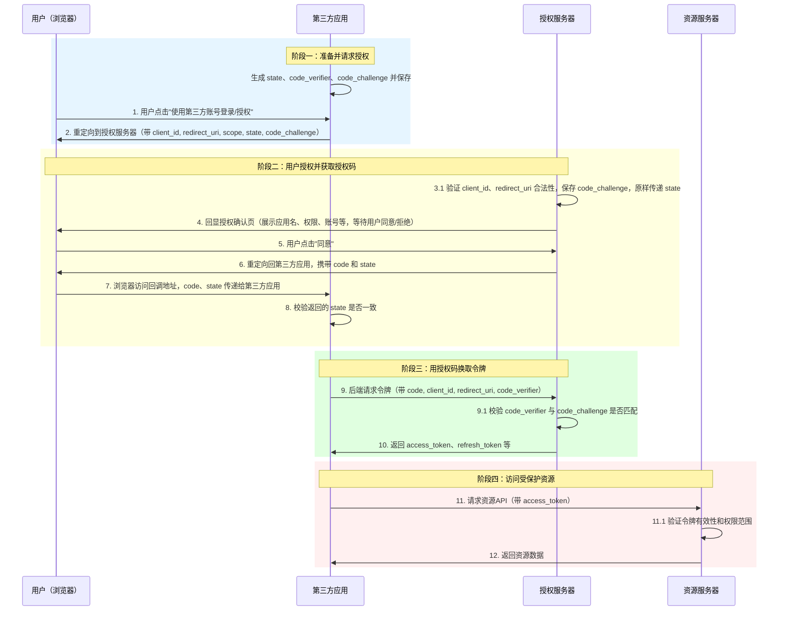

# OAuth 2.0 实战落地指南

## 1. 概念与核心角色（大白话）

- **OAuth 2.0 是什么？**
  - 一种让第三方应用“安全地”访问你在别的服务上的数据的授权机制。
  - 不是认证（不是用来登录），是授权（让别人用有限权限帮你办事）。

- **四大角色**
  - **资源所有者**：用户本人。
  - **客户端**：想要访问你数据的第三方应用。
  - **授权服务器**：负责发放令牌的服务（比如微信开放平台、百度网盘授权中心）。
  - **资源服务器**：真正存你数据的地方。

---

## 2. 核心流程（主流程图+关键参数说明+大白话）

> **流程大白话：**
> 1. 客户端让你跳转到授权服务器，带上“暗号”（state）、“加密提示”（code_challenge）。
> 2. 你同意授权，授权服务器给客户端一张“临时票”（code），原样带回“暗号”。
> 3. 客户端用“钥匙”（code_verifier）和“临时票”去换“通行证”（access_token）。
> 4. 拿着“通行证”去资源服务器办事。



> **关键参数说明：**
> - state：客户端生成的“暗号”，防止别人冒充你收快递（防CSRF）。
> - code_verifier/code_challenge：PKCE机制，防止“临时票”被别人半路偷走用掉。
> - access_token/refresh_token：通行证和续期凭证。
>
> **大白话解释：**
> - state 就像你和快递员约定的“暗号”，发快递时带上，收快递时核对，防止别人冒充你收快递。
> - PKCE 就像快递箱的“二次密码锁”，你下单时给快递员加密提示，真正的钥匙自己留着，快递送到时用钥匙开锁，别人半路偷了快递也没用。

---

## 3. 接口与表操作详解（含DDL）

### 3.1 表结构 DDL 示例

```sql
-- 客户端信息表
CREATE TABLE oauth2_client (
  client_id VARCHAR(64) PRIMARY KEY,
  client_secret VARCHAR(128) NOT NULL,
  redirect_uri VARCHAR(256) NOT NULL,
  name VARCHAR(64),
  scope VARCHAR(128)
);

-- 授权码表
CREATE TABLE oauth2_auth_code (
  code VARCHAR(128) PRIMARY KEY,
  client_id VARCHAR(64) NOT NULL,
  user_id VARCHAR(64) NOT NULL,
  redirect_uri VARCHAR(256),
  scope VARCHAR(128),
  code_challenge VARCHAR(128),
  expires_at DATETIME NOT NULL,
  used BOOLEAN DEFAULT FALSE
);

-- 令牌表
CREATE TABLE oauth2_token (
  token VARCHAR(128) PRIMARY KEY,
  client_id VARCHAR(64) NOT NULL,
  user_id VARCHAR(64) NOT NULL,
  scope VARCHAR(128),
  type ENUM('access', 'refresh') NOT NULL,
  expires_at DATETIME NOT NULL,
  revoked BOOLEAN DEFAULT FALSE
);

-- 可选：token吊销/黑名单表
CREATE TABLE oauth2_token_blacklist (
  token VARCHAR(128) PRIMARY KEY,
  revoked_at DATETIME NOT NULL
);
```

### 3.2 每一步接口与表操作说明

| 步骤 | 接口 | 涉及表 | 操作类型 | 说明 |
|------|------|--------|----------|------|
| 1. 客户端注册 | /register_client | oauth2_client | INSERT | 管理员/开发者注册新客户端，生成 client_id/secret |
| 2. 请求授权 | /authorize | oauth2_auth_code | INSERT | 生成 code，接收客户端传来的 state 和 code_challenge，写入授权码表 |
| 3. 用户授权 | /authorize | oauth2_auth_code | UPDATE | 用户同意后，更新 code 记录，设置有效期 |
| 4. 换取令牌 | /token | oauth2_auth_code、oauth2_token | SELECT/INSERT/UPDATE | 校验 code、code_verifier，生成 access_token/refresh_token，写入令牌表，标记 code 已用 |
| 5. 访问资源 | /resource | oauth2_token | SELECT | 校验 access_token 是否有效、未吊销、未过期 |
| 6. 刷新令牌 | /token (grant_type=refresh_token) | oauth2_token | SELECT/INSERT/UPDATE | 校验 refresh_token，生成新 access_token，更新令牌表 |
| 7. 吊销令牌 | /revoke | oauth2_token、oauth2_token_blacklist | UPDATE/INSERT | 标记 token 为 revoked，或写入黑名单表 |

---

## 4. 客户端开发落地指引

1. **注册应用，获取 client_id、client_secret、redirect_uri**
2. **实现授权请求**  
   - 生成 state、code_verifier、code_challenge
   - 跳转到 /authorize
3. **处理回调**  
   - 校验 state
   - 获取 code
4. **用 code 换取 token**  
   - POST /token，带 code、code_verifier
   - 获取 access_token、refresh_token
5. **带 access_token 访问资源 API**
6. **access_token 过期后用 refresh_token 换新 token**

---

## 5. 服务端开发落地指引

1. **实现客户端注册接口 /register_client**
2. **实现授权端点 /authorize**  
   - 校验 client_id、redirect_uri
   - 生成 code，接收客户端传来的 code_challenge 和 state，并与 code 一起写入 oauth2_auth_code
   - **回显授权确认页，展示应用名、权限、账号等，等待用户同意/拒绝**
   - 用户同意后，更新 code 记录
3. **实现令牌端点 /token**  
   - 校验 code、code_verifier
   - 生成 access_token、refresh_token，写入 oauth2_token
   - 标记 code 已用
4. **实现资源接口 /resource**  
   - 校验 access_token
5. **实现刷新和吊销接口 /token、/revoke**
6. **定期清理过期数据**

---

## 6. 常见问题与安全建议

- state 和 PKCE 必须同时用，防止 CSRF 和授权码拦截
- 所有临时数据（code、token）都要有过期时间
- client_secret 只在服务端保存，前端绝不暴露
- 令牌建议用高强度随机字符串
- 生产环境建议用 HTTPS
- 定期清理过期和已吊销的 token，防止表无限增长

---

> 只要照着本指南的流程、表结构和接口实现，OAuth2 客户端和服务端开发都能快速落地，安全合规！
