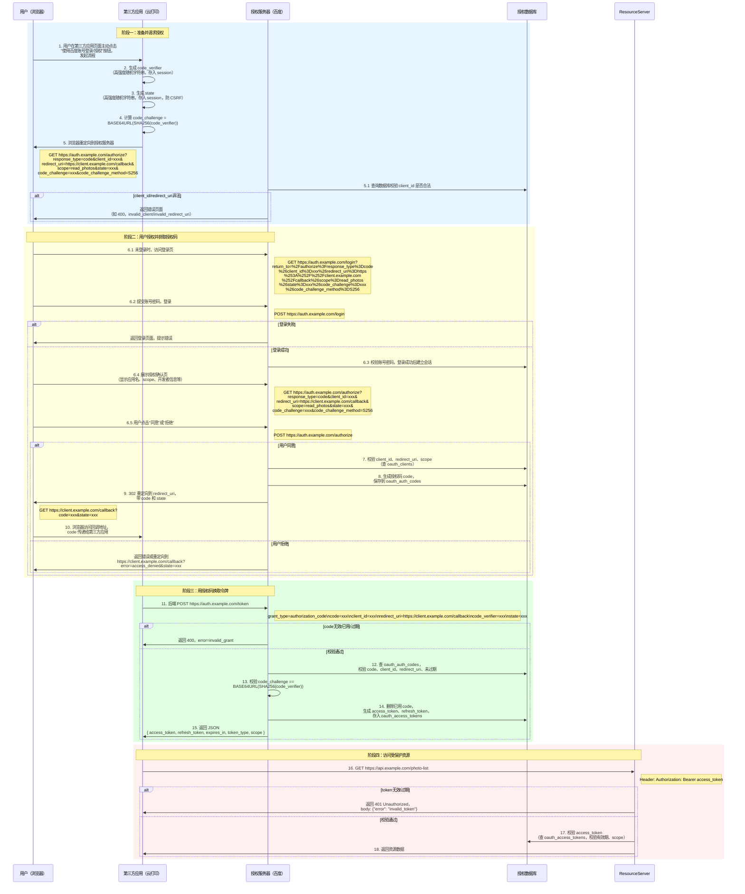
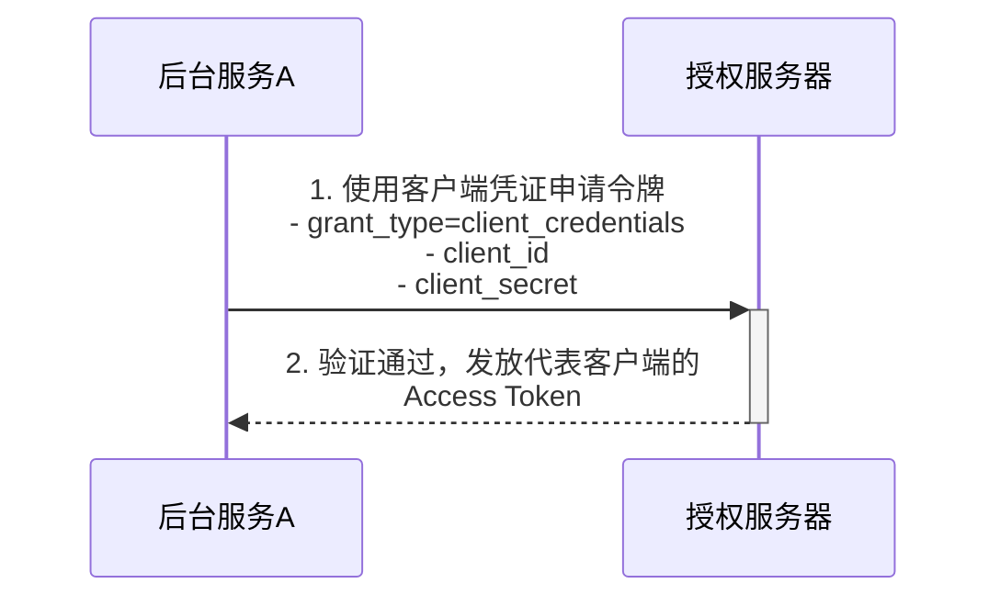

# OAuth 2.0 学习笔记

你好！作为一名后端开发者，了解 OAuth 2.0 是非常重要的。它是一种行业标准的授权框架，能让应用程序在不获取用户密码的情况下，访问用户在另一个服务上的私有资源。接下来，我将带你一步步深入了解它。

## 第一步：什么是 OAuth 2.0？

首先，我们要明确一点：**OAuth 2.0 是一个授权（Authorization）框架，而不是一个认证（Authentication）协议。**

- **认证 (Authentication)**：是验证"你是谁"的过程（例如，通过用户名和密码登录）。
- **授权 (Authorization)**：是验证"你有什么权限"的过程（例如，允许某个应用读取你的微信步数，但不能发朋友圈）。

简单来说，OAuth 2.0 解决的核心问题是 **"委托授权"**。

想象一个场景：有一个第三方的照片打印服务（我们称之为"云打印"），你希望它能访问并打印你在"百度网盘"里存储的照片。如果没有 OAuth 2.0，你可能会怎么做？

最直接但最不安全的方法是：把你的百度网盘账号和密码告诉"云打印"服务。

这样做会带来巨大的风险：
1.  **安全风险**："云打印"服务拿到了你的完整权限，它不仅可以读取你的照片，还可以删除你的文件、查看你的私密文档等等。
2.  **密码泄露**："云打印"服务需要安全地存储你的密码，如果它的数据库被黑客攻击，你的百度网盘密码就会泄露。
3.  **权限无法控制**：你无法限制"云打印"只能读取照片，也无法控制授权的有效期。
4.  **撤销授权困难**：一旦你把密码给了它，想撤销授权只能去修改你的百度网盘密码，这会导致所有依赖该密码的服务全部失效。

**OAuth 2.0 的出现就是为了优雅地解决这个问题。**

通过 OAuth 2.0，你可以授权"云打印"服务直接从"百度网盘"获取你的照片，而完全不需要将你的百度网盘密码告诉"云打印"。你只是在百度网盘的授权页面上点击"同意"，百度网盘就会生成一个临时的、有特定权限（比如"只读照片"）的"令牌"（Token）给"云打印"。"云打印"就用这个令牌去获取你的照片。

这个过程就像你去住酒店：
- 你（**用户**）在前台出示身份证（**认证**）。
- 前台（**授权服务**）确认你的身份后，给你一张房卡（**访问令牌/Access Token**）。
- 这张房卡只能打开你自己的房间门（**有限的权限**），并且有时间限制（**有效期**），但你不能用它去打开酒店经理的办公室。
- 你不需要把你的身份证（**密码**）交给房门锁（**第三方应用**）。

## 第二步：OAuth 2.0 的核心角色

在 OAuth 2.0 的授权流程中，有四个主要的角色：

1.  **资源所有者 (Resource Owner)**
    -   通常就是指**用户**（你）。
    -   是能够授权访问受保护资源（例如你的照片、联系人列表）的实体。

2.  **客户端 (Client)**
    -   指希望访问用户资源的**第三方应用程序**，例如我们之前提到的"云打印"服务。
    -   客户端必须在授权服务器上进行注册，并获得一个唯一的客户端 ID（`client_id`）和客户端密钥（`client_secret`）。

3.  **授权服务器 (Authorization Server)**
    -   负责**验证用户身份**并发放**访问令牌（Access Token）**的服务器。
    -   例如，百度网盘的授权服务。它在成功验证用户并获得用户授权后，会向客户端发放令牌。

4.  **资源服务器 (Resource Server)**
    -   存储用户受保护资源的服务器，例如存储着你照片的百度网盘服务器。
    -   它会验证客户端提供的访问令牌，如果令牌有效，则向客户端提供其请求的资源。

在很多场景下，**授权服务器**和**资源服务器**可能是同一个服务，或者由同一个公司提供。

## 第三步：核心流程 - 带 PKCE 的授权码模式

授权码模式是 OAuth 2.0 中功能最完整、流程最严谨、也是最安全的一种授权模式。为了应对移动端和单页应用（SPA）等无法安全存储密钥的场景，现代实践中通常会结合 **PKCE (Proof Key for Code Exchange)** 来使用。PKCE 是对授权码模式的安全增强，现在已成为**推荐的标配**。

**核心思想**：授权过程分为两步，先通过浏览器获取一个临时的**授权码 (code)**，然后客户端的后端（或安全的客户端）再用这个授权码和额外的验证信息去换取**访问令牌 (Access Token)**。这确保了敏感的令牌不会直接暴露在前端。

### 1. 细化整体流程图（开发落地视角）

> **整个流程的起点是用户在第三方应用页面主动点击"使用百度账号登录/授权"按钮。**



#### 关键接口说明

- **https://auth.example.com/authorize**（GET/POST）：
  - GET：展示授权页面（未登录时重定向到 /login）
  - POST：用户同意或拒绝授权
  - 参数：
    - response_type: code
    - client_id: 客户端ID
    - redirect_uri: 回调地址
    - scope: 权限范围（如 read_photos）
    - state: 随机字符串，防CSRF，强烈建议校验
    - code_challenge: PKCE参数
    - code_challenge_method: S256
  - 返回：
    - 成功：授权页面（GET），或 302 跳转（同意后）
    - 失败：错误页面或 JSON
  - 典型错误：
    ```json
    { "error": "invalid_client", "error_description": "client_id 不存在" }
    ```
    ```json
    { "error": "invalid_redirect_uri" }
    ```
    ```json
    { "error": "invalid_scope" }
    ```
  - 安全建议：强制校验 state，防止 CSRF

- **https://auth.example.com/login**（GET/POST）：
  - GET：展示登录页面
  - POST：提交账号密码，登录
  - 返回：
    - 成功：跳转到授权页面
    - 失败：返回登录页面，提示错误

- **https://auth.example.com/token**（POST）：
  - 参数：
    - grant_type: authorization_code
    - code: 授权码
    - client_id: 客户端ID
    - redirect_uri: 回调地址
    - code_verifier: PKCE参数
  - 返回：
    - 成功：
      ```json
      {
        "access_token": "xxx",
        "refresh_token": "yyy",
        "expires_in": 3600,
        "token_type": "Bearer",
        "scope": "read_photos"
      }
      ```
    - 失败：
      ```json
      { "error": "invalid_grant", "error_description": "授权码无效或已过期" }
      ```
  - 安全建议：access_token、refresh_token 均为高强度不可预测字符串，access_token 有较短有效期，refresh_token 有更长有效期。

- **https://api.example.com/photo-list**（GET）：
  - Header：Authorization: Bearer access_token
  - 返回：
    - 成功：资源数据
    - 失败：
      ```json
      { "error": "invalid_token" }
      ```
  - 安全建议：校验 access_token 有效性、scope，token 过期返回 401。

### 2. 数据库设计

一个 OAuth 2.0 服务至少需要几张核心表来存储客户端信息、授权记录和令牌。

**a. 客户端信息表 (`oauth_clients`)**

```sql
CREATE TABLE oauth_clients (
    client_id VARCHAR(80) NOT NULL,          -- 客户端ID，唯一标识
    client_secret VARCHAR(80) NOT NULL,      -- 客户端密钥，用于保密客户端验证
    redirect_uris TEXT NOT NULL,             -- 允许重定向的回调URI列表（多个用逗号分隔）
    grant_types VARCHAR(100) NOT NULL,       -- 允许该客户端使用的授权模式 (e.g., 'authorization_code,refresh_token')
    scope VARCHAR(255),                      -- 允许该客户端申请的权限范围
    PRIMARY KEY (client_id)
);
```

**b. 授权码表 (`oauth_auth_codes`)**

```sql
CREATE TABLE oauth_auth_codes (
    auth_code VARCHAR(40) NOT NULL,          -- 授权码本身
    client_id VARCHAR(80) NOT NULL,          -- 关联的客户端ID
    user_id VARCHAR(80),                     -- 授权的用户ID
    redirect_uri TEXT NOT NULL,              -- 当时请求使用的回调URI
    expires TIMESTAMP NOT NULL,              -- 过期时间（通常很短，如10分钟）
    scope VARCHAR(255),                      -- 本次授权的范围
    code_challenge VARCHAR(255),             -- PKCE 的 code_challenge
    PRIMARY KEY (auth_code)
);
```

**c. 令牌表 (`oauth_access_tokens`)**

```sql
CREATE TABLE oauth_access_tokens (
    access_token VARCHAR(40) NOT NULL,       -- 访问令牌
    refresh_token VARCHAR(40),               -- 刷新令牌
    client_id VARCHAR(80) NOT NULL,          -- 关联的客户端ID
    user_id VARCHAR(80),                     -- 关联的用户ID
    expires TIMESTAMP NOT NULL,              -- 访问令牌的过期时间
    scope VARCHAR(255),                      -- 令牌的权限范围
    PRIMARY KEY (access_token)
);
```

### 3. 刷新令牌（Refresh Token）流程

- 客户端 POST https://auth.example.com/token，参数：grant_type=refresh_token, refresh_token, client_id
- 授权服务器校验 refresh_token，生成新 access_token，返回 JSON
- 失败：
  ```json
  { "error": "invalid_grant", "error_description": "refresh_token 无效或已过期" }
  ```
- 安全建议：refresh_token 建议为一次性使用或定期轮换，防止泄露风险。

## 第四步：其他授权模式简介

虽然带 PKCE 的授权码模式是首选，但了解其他模式有助于理解 OAuth 2.0 的完整设计。

| 模式 | 适用场景 | 安全性 | 是否推荐 | 备注 |
| :--- | :--- | :--- | :--- | :--- |
| **简化模式 (Implicit)** | 纯前端应用 (SPA) | 低 | **不推荐** | 已被带 PKCE 的授权码模式取代。 |
| **密码模式 (Password)** | 高度信任的自家应用 | 中 | **不推荐** | 违背 OAuth 核心思想，有更好的替代方案。 |
| **客户端凭证模式 (Client Credentials)** | 服务器到服务器通信 | 高 | **推荐** | 用于机器间的授权，无用户参与。 |

### 客户端凭证模式流程

这是唯一一个在特定场景下仍然被广泛推荐的模式。



## 总结

恭喜你！到这里，你已经学习了 OAuth 2.0 的核心概念和现代化的实践流程。我们回顾一下：

1.  **OAuth 2.0 是一个授权框架**，用于解决委托授权问题。
2.  **核心角色**：资源所有者、客户端、授权服务器、资源服务器。
3.  **首选授权模式**：**带 PKCE 的授权码模式**，它结合了授权码模式的安全性和 PKCE 的灵活性，适用于所有类型的应用。
4.  **Refresh Token** 用于在 Access Token 过期后以静默方式获取新的令牌，提升用户体验。
5.  **客户端凭证模式** 是处理服务器间通信的理想选择。

通过将理论、流程图、数据库设计和代码实现结合起来，希望这份笔记能让你对 OAuth 2.0 有一个更深入、更直观的理解。
