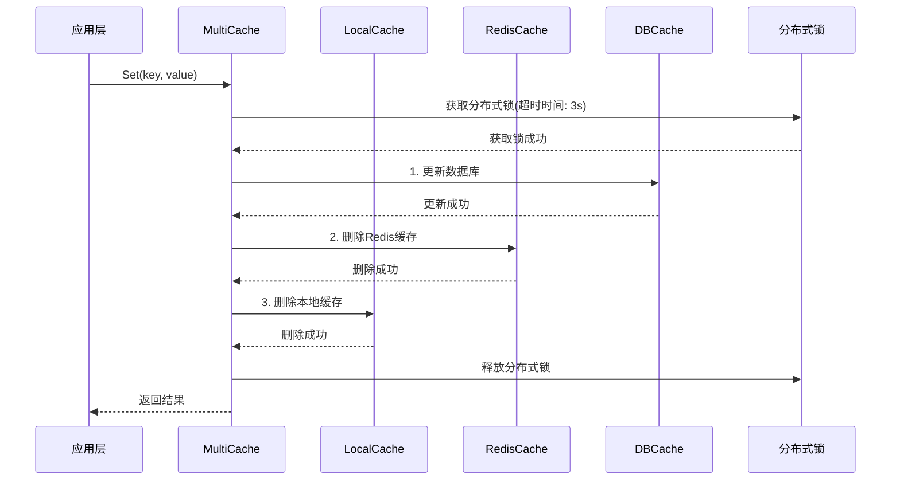
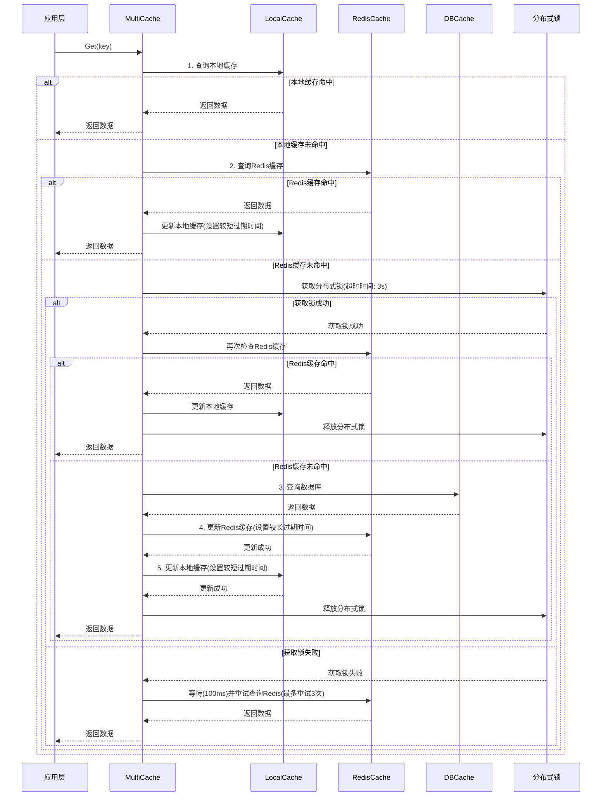
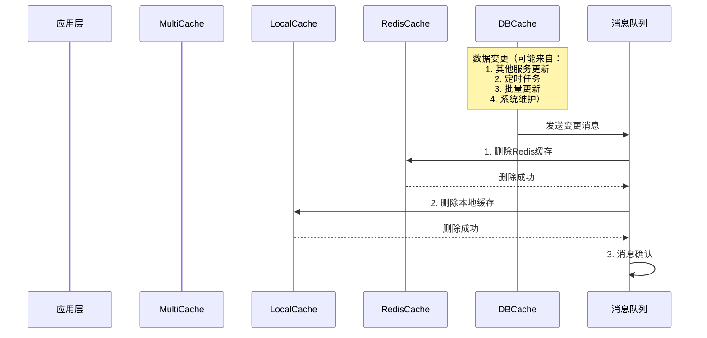

# 多级缓存一致性流程

## 写入流程

### 写入策略说明

1. **删除缓存策略（推荐）**
    - 优点：
        - 实现简单，不需要考虑原子性
        - 避免并发更新导致的数据不一致
        - 保证数据最终一致性
    - 缺点：
        - 可能增加数据库访问次数
        - 在缓存删除后到下次加载前，性能可能下降

2. **更新缓存策略（特定场景）**
    - 适用场景：
        - 对性能要求极高的场景
        - 数据更新频率较低的场景
        - 可以接受短暂的数据不一致
    - 实现方式：
        - 使用分布式锁确保更新原子性
        - 采用版本号或时间戳控制并发
        - 实现更新失败的重试机制
    - 注意事项：
        - 需要处理并发更新冲突
        - 需要实现更新失败的回滚机制
        - 建议配合本地缓存过期时间使用

## 读取流程

## 缓存预热机制

1. **系统启动预热**
    - 实现方式：
        - 系统启动时加载热点数据
        - 采用多线程并行加载
        - 设置加载超时时间(默认30s)
    - 加载策略：
        - 按业务优先级加载
        - 分批加载，避免系统压力过大
        - 失败重试机制(最多重试3次)

2. **定时预热**
    - 实现方式：
        - 定时任务定期更新热点数据
        - 根据访问频率动态调整预热策略
        - 设置任务执行时间窗口(建议业务低峰期)
    - 更新策略：
        - 增量更新，避免全量刷新
        - 设置更新阈值，避免频繁更新
        - 失败告警机制

## 热点数据处理

1. **热点数据识别**
    - 识别方式：
        - 访问频率统计(每分钟访问次数>1000)
        - 业务重要性评估(核心业务数据)
        - 数据更新频率分析(更新间隔>1小时)
    - 统计方法：
        - 实时统计(最近1分钟)
        - 历史统计(最近24小时)
        - 趋势分析(最近7天)

2. **处理策略**
    - 缓存策略：
        - 设置更长的缓存时间(本地缓存5分钟，Redis缓存1小时)
        - 增加缓存副本(本地缓存多份)
        - 实现本地缓存优先
    - 更新策略：
        - 异步更新，避免阻塞
        - 批量更新，提高效率
        - 失败重试机制

## 缓存过期时间策略

1. **本地缓存过期时间**
    - 设置原则：
        - 必须设置过期时间
        - 过期时间要短于Redis缓存
        - 建议30秒到5分钟
    - 具体配置：
        - 普通数据：30秒
        - 热点数据：5分钟
        - 配置数据：1分钟
    - 作用：
        - 防止本地缓存与Redis数据不一致
        - 作为删除缓存失败的兜底机制
        - 控制内存占用

2. **Redis缓存过期时间**
    - 设置原则：
        - 建议设置过期时间
        - 过期时间要长于本地缓存
        - 建议30分钟到24小时
    - 具体配置：
        - 普通数据：30分钟
        - 热点数据：1小时
        - 配置数据：2小时
    - 作用：
        - 防止Redis中存储过期数据
        - 作为最终兜底机制
        - 控制内存占用

3. **过期时间设置建议**
    - 根据数据更新频率调整：
        - 高频更新(分钟级)：30分钟
        - 中频更新(小时级)：2小时
        - 低频更新(天级)：24小时
    - 根据数据一致性要求调整：
        - 强一致性：较短过期时间
        - 最终一致性：较长过期时间
    - 根据系统资源情况调整：
        - 内存充足：较长过期时间
        - 内存紧张：较短过期时间

## 缓存删除流程

### 缓存删除流程说明

1. **消息队列可靠性保证**
    - 消息持久化：
        - 消息写入磁盘
        - 定期备份消息
        - 多副本存储
    - 重试机制：
        - 设置最大重试次数(3次)
        - 采用指数退避策略(100ms, 200ms, 400ms)
        - 记录重试日志
    - 死信队列：
        - 处理失败消息
        - 人工介入处理
        - 告警通知

2. **消息幂等性处理**
    - 实现方式：
        - 消息ID去重
        - 业务状态检查
        - 版本号控制
    - 处理策略：
        - 丢弃重复消息
        - 更新最新状态
        - 记录处理日志

## 异常处理机制

1. **Redis连接异常**
    - 处理策略：
        - 连接池配置(最大连接数100，最小空闲连接10)
        - 连接超时设置(连接超时1s，读写超时2s)
        - 自动重连机制(最多重试3次)
    - 降级策略：
        - 直接访问数据库
        - 使用本地缓存
        - 返回默认值

2. **数据库连接异常**
    - 处理策略：
        - 连接池配置(最大连接数50，最小空闲连接5)
        - 连接超时设置(连接超时1s，查询超时3s)
        - 自动重连机制(最多重试3次)
    - 降级策略：
        - 使用缓存数据
        - 返回默认值
        - 服务降级

3. **消息队列连接异常**
    - 处理策略：
        - 连接池配置(最大连接数20，最小空闲连接2)
        - 连接超时设置(连接超时1s，发送超时2s)
        - 自动重连机制(最多重试3次)
    - 降级策略：
        - 同步处理
        - 本地队列
        - 服务降级

## 监控告警机制

1. **性能指标监控**
    - 缓存指标：
        - 命中率(阈值：本地缓存>80%，Redis缓存>90%)
        - 响应时间(阈值：本地缓存<1ms，Redis缓存<5ms)
        - 内存使用率(阈值：<80%)
    - 系统指标：
        - CPU使用率(阈值：<70%)
        - 内存使用率(阈值：<80%)
        - 网络延迟(阈值：<100ms)

2. **业务指标监控**
    - 访问指标：
        - QPS(阈值：<1000)
        - 并发数(阈值：<100)
        - 错误率(阈值：<0.1%)
    - 数据指标：
        - 数据一致性(阈值：100%)
        - 数据延迟(阈值：<1s)
        - 数据准确性(阈值：100%)

3. **告警策略**
    - 告警级别：
        - 严重(立即处理)
        - 警告(24小时内处理)
        - 提示(观察处理)
    - 告警方式：
        - 短信通知
        - 邮件通知
        - 系统通知

## 一致性保证机制

1. **写入一致性**
    - 使用分布式锁确保并发写入安全
    - 采用"先更新数据库，再删除缓存"的策略
    - 删除缓存而不是更新缓存，避免缓存不一致

2. **读取一致性**
    - 采用"先读缓存，缓存未命中再读数据库"的策略
    - 使用分布式锁防止缓存击穿
    - 本地缓存设置较短的过期时间

3. **缓存删除**
    - 通过消息队列实现缓存删除的异步通知
    - 采用"删除缓存"而不是"更新缓存"的策略
    - 本地缓存设置较短的过期时间，作为兜底机制

4. **并发控制**
    - 使用分布式锁控制并发访问
    - 采用乐观锁或版本号机制处理并发更新
    - 实现请求合并，减少重复请求

5. **异常处理**
    - 实现降级策略，在缓存服务不可用时直接访问数据库
    - 记录异常日志，便于问题排查
    - 实现重试机制，处理临时性故障

6. **分布式锁处理**
    - 锁获取失败处理：
        - 设置最大重试次数(3次)
        - 采用退避策略(100ms, 200ms, 400ms)
        - 降级为直接访问数据库
    - 锁超时处理：
        - 自动续期机制(每30s续期一次)
        - 超时告警(超过3s)
        - 手动干预机制

7. **缓存雪崩防护**
    - 实现方式：
        - 缓存过期时间随机化(±10%)
        - 多级缓存架构
        - 熔断降级机制
    - 监控告警：
        - 缓存命中率监控(阈值：<80%)
        - 响应时间监控(阈值：>100ms)
        - 系统资源监控(阈值：>80%)

8. **主从延迟处理**
    - 实现方式：
        - 读写分离策略
        - 延迟监控(阈值：<1s)
        - 降级处理
    - 处理策略：
        - 设置最大容忍延迟(1s)
        - 延迟超过阈值时降级
        - 定期同步检查(每5分钟) 